例1：[玻璃瓶纪念品] （[by 硅谷米哥]([硅谷米哥 - 小红书](https://www.xiaohongshu.com/user/profile/5f84695f0000000001008c8d?xsec_token=YBykWtZTdRMP1pyA3Pg-KU81AS-vU6lPEM-VL5M3bni6c=&xsec_source=app_share&xhsshare=CopyLink&shareRedId=ODs1Njo4OUE2NzUyOTgwNjY3OTc9Nkc9&apptime=1758443455&share_id=dc4d26610fcd4a30b0197d689c0cc308))）

| 输入                                                                                                 | 输出                                       |
|:--------------------------------------------------------------------------------------------------:|:----------------------------------------:|
|  | 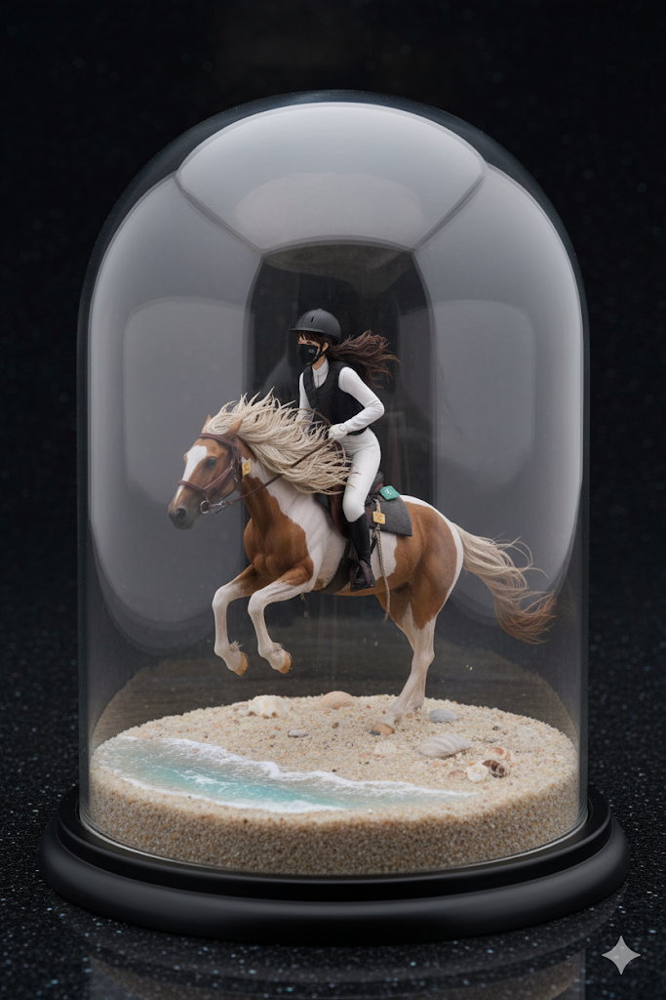 |

**输入:** 需上传一张参考图像

**提示词:**

```
1/7比例的商品化收藏级人偶，以照片中人物为原型，高度写实的风格打造。人偶置于细致的沙滩环境中，沙滩、贝壳和轻柔的海浪交织在一起。整个玩具展示架被封装在一个透明的纪念品玻璃瓶中，使其呈现出高端的微缩立体模型效果，并拥有逼真的光影效果。
```

例2：[建造中的女神] （[by 硅谷米哥]([硅谷米哥 - 小红书](https://www.xiaohongshu.com/user/profile/5f84695f0000000001008c8d?xsec_token=YBykWtZTdRMP1pyA3Pg-KU81AS-vU6lPEM-VL5M3bni6c=&xsec_source=app_share&xhsshare=CopyLink&shareRedId=ODs1Njo4OUE2NzUyOTgwNjY3OTc9Nkc9&apptime=1758443455&share_id=dc4d26610fcd4a30b0197d689c0cc308))）

| 输入                                                                                                           | 输出                                                                                                           |
|:------------------------------------------------------------------------------------------------------------:|:------------------------------------------------------------------------------------------------------------:|
| 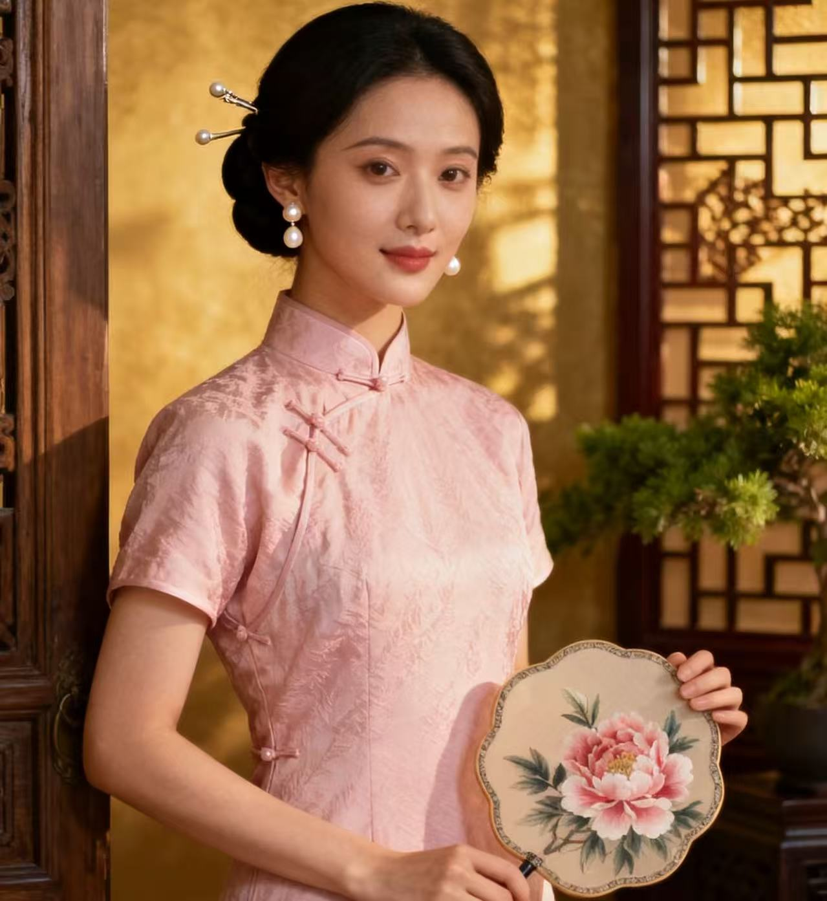 | 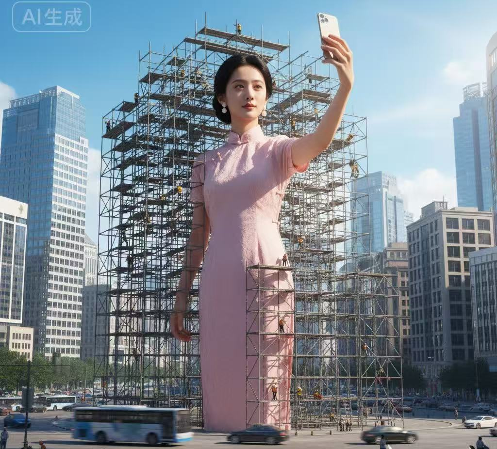 |

**输入:** 需上传一张参考图像

**提示词:**

```
图片中人物站着自拍的超写实3D渲染图。画面里这个巨型人物全身环绕着庞大的脚手架，脚手架上有许多身形微小的建筑工人正在作业。场景设定在一个城市广场，周围是现代化建筑，还有行驶中的交通工具（轿车、公交车）、行人，以及晴朗明亮的湛蓝天空。整体细节丰富，呈现出照片级的真实质感，且采用了电影级灯光效果
```

例3：[不同时代的自己] （[by 硅谷米哥]([硅谷米哥 - 小红书](https://www.xiaohongshu.com/user/profile/5f84695f0000000001008c8d?xsec_token=YBykWtZTdRMP1pyA3Pg-KU81AS-vU6lPEM-VL5M3bni6c=&xsec_source=app_share&xhsshare=CopyLink&shareRedId=ODs1Njo4OUE2NzUyOTgwNjY3OTc9Nkc9&apptime=1758443455&share_id=dc4d26610fcd4a30b0197d689c0cc308))）

| 输入                                                                                                   | 输出                                                                                                   |
| ---------------------------------------------------------------------------------------------------- | ---------------------------------------------------------------------------------------------------- |
| 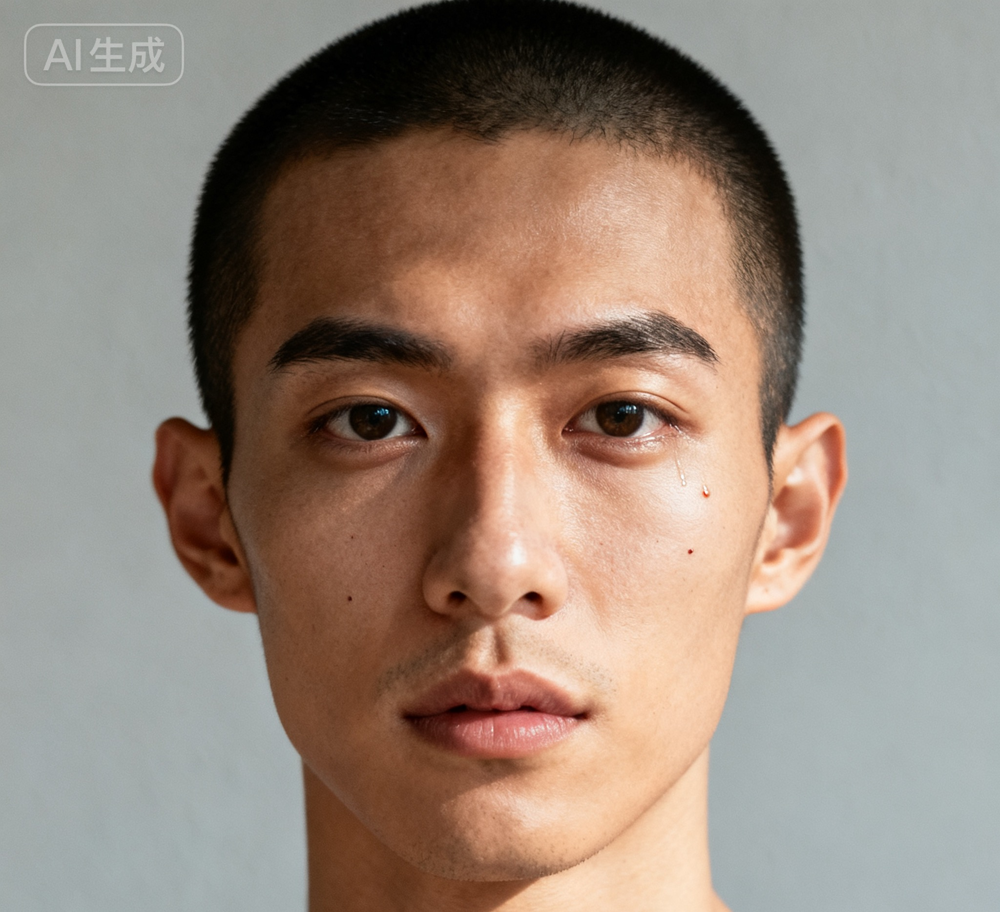 | 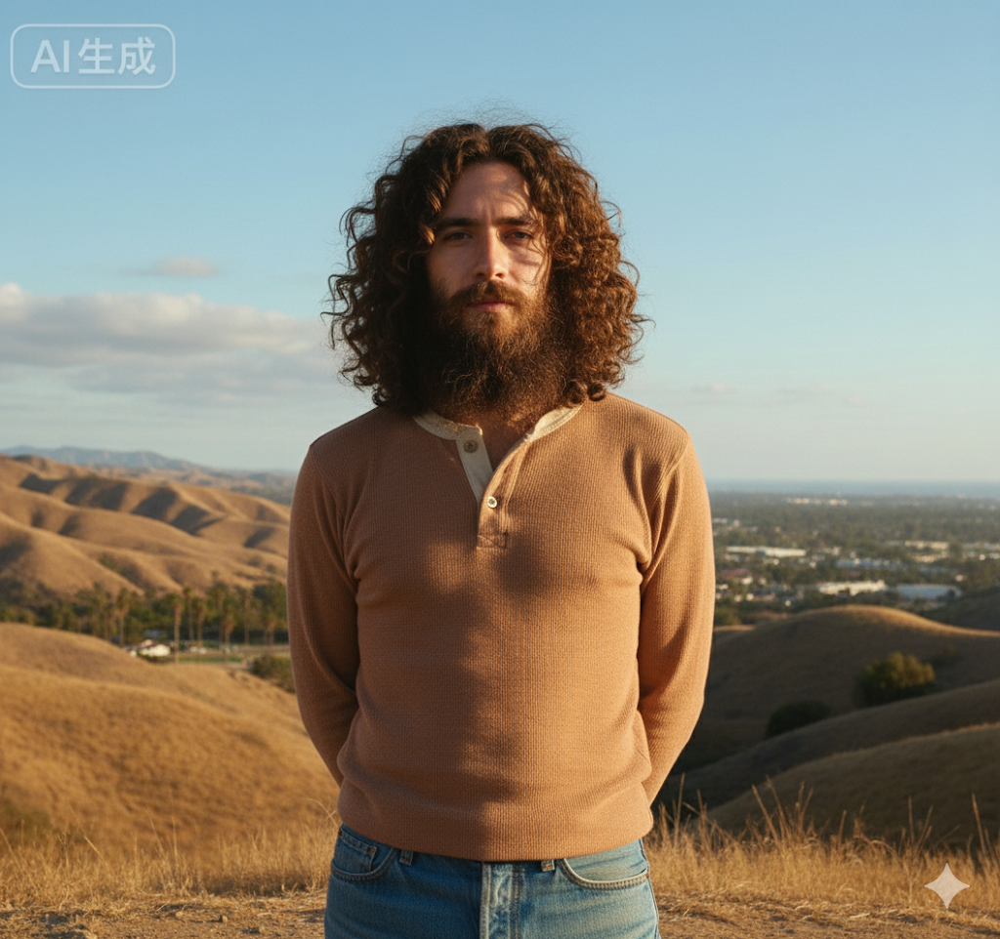 |

**输入:** 需上传一张参考图像

**提示词:**

```
将角色的风格改为[1970]年代的经典[男性]风格
添加[长卷发]，
[长胡子]，
将背景改为标志性的[加州夏季风景]
不要改变角色的面部
```

例4：[海盗通缉书] （[by 硅谷米哥]([硅谷米哥 - 小红书](https://www.xiaohongshu.com/user/profile/5f84695f0000000001008c8d?xsec_token=YBykWtZTdRMP1pyA3Pg-KU81AS-vU6lPEM-VL5M3bni6c=&xsec_source=app_share&xhsshare=CopyLink&shareRedId=ODs1Njo4OUE2NzUyOTgwNjY3OTc9Nkc9&apptime=1758443455&share_id=dc4d26610fcd4a30b0197d689c0cc308))）

| 输入                                                                                                   | 输出                                                                                                   |
| ---------------------------------------------------------------------------------------------------- | ---------------------------------------------------------------------------------------------------- |
|  | 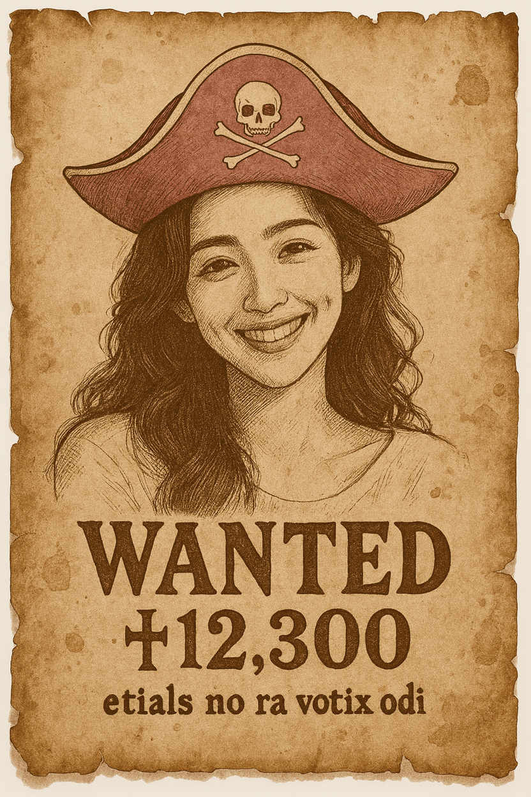 |

**输入:** 需上传一张参考图像

**提示词:**

```
使用原始图像，在羊皮纸上重新绘制一张海盗通缉令。

棕色单色，带有陈旧羊皮纸的纹理。

保留原始图像的风格和人物设计，直至最小的细节，并将其大尺寸粘贴在通缉令的顶部。

脸部特写。让角色戴上粉色海盗帽。

在海报底部写上赏金金额。赏金金额将是随机的，并使用虚拟的货币单位。

在赏金金额下方，用小写字母写出罪行。请使用虚拟语言。不得使用英文或中文。
```

例5：[九宫格照片]("图片合集/九宫格.png) （[by 硅谷米哥]([硅谷米哥 - 小红书](https://www.xiaohongshu.com/user/profile/5f84695f0000000001008c8d?xsec_token=YBykWtZTdRMP1pyA3Pg-KU81AS-vU6lPEM-VL5M3bni6c=&xsec_source=app_share&xhsshare=CopyLink&shareRedId=ODs1Njo4OUE2NzUyOTgwNjY3OTc9Nkc9&apptime=1758443455&share_id=dc4d26610fcd4a30b0197d689c0cc308))）

| 输入                                                                                                   | 输出                                                                              |
|:----------------------------------------------------------------------------------------------------:|:-------------------------------------------------------------------------------:|
|  |  |

**输入:** 需上传一张参考图像

**提示词:**

```
用这张照片，做一个3*3的photo booth grid，每张要用不同的姿势和表情不许重复
```

例6：[美式证件照]("图片合集/美式证件照.png) （[by 硅谷米哥]([硅谷米哥 - 小红书](https://www.xiaohongshu.com/user/profile/5f84695f0000000001008c8d?xsec_token=YBykWtZTdRMP1pyA3Pg-KU81AS-vU6lPEM-VL5M3bni6c=&xsec_source=app_share&xhsshare=CopyLink&shareRedId=ODs1Njo4OUE2NzUyOTgwNjY3OTc9Nkc9&apptime=1758443455&share_id=dc4d26610fcd4a30b0197d689c0cc308))）

| 输入                                                                                                   | 输出                                                                                |
|:----------------------------------------------------------------------------------------------------:|:---------------------------------------------------------------------------------:|
|  |  |

**输入:** 需上传一张参考图像

**提示词:**

```
将上传的肖像照转换为美式专业形象照风格（企业摄影风格），同时保留原人物的面部特征与身份辨识度。要求：半身人像、蓝色纹理影棚背景、柔和自然影棚光线、高清画质、真实肤色、构图干净优雅。人物需身着无袖黑色连衣裙，设计简约优雅，体现现代专业风格，搭配简约金色饰品。表情应放松自信、自然大方，眼神明亮有神，带有真诚微笑。保持面部清晰对焦，背景轻微虚化以增强层次感，整体效果精致专业。
```

例7：[儿童水杯广告图]("图片合集/儿童喝水.png) （[by 硅谷米哥]([硅谷米哥 - 小红书](https://www.xiaohongshu.com/user/profile/5f84695f0000000001008c8d?xsec_token=YBykWtZTdRMP1pyA3Pg-KU81AS-vU6lPEM-VL5M3bni6c=&xsec_source=app_share&xhsshare=CopyLink&shareRedId=ODs1Njo4OUE2NzUyOTgwNjY3OTc9Nkc9&apptime=1758443455&share_id=dc4d26610fcd4a30b0197d689c0cc308))）

| 输入                                                                             | 输出                                                                               |
|:------------------------------------------------------------------------------:|:--------------------------------------------------------------------------------:|
|  |  |

**输入:** 需上传一张参考图像

**提示词:**

```
将图片产品作为主体，产品细节保持不变，生成16:9产品广告图，采用写实风格，画面布局为中心突出主体，背景简洁衬托，主体是一个亚洲小女孩，穿着浅米色带白色装饰的衣服，头发用黄色小发饰扎起，双手捧着水杯，小女孩坐在精致的儿童餐椅里，将小女孩水杯置于画面视觉中心，光线为柔和的室内自然光，均匀酒在人物和物品上，营造出温暖、舒适的氛围，整体氛围温馨、童趣
```

例8：[夜晚火车窗]("图片合集/夜晚火车.png) （[by 硅谷米哥]([硅谷米哥 - 小红书](https://www.xiaohongshu.com/user/profile/5f84695f0000000001008c8d?xsec_token=YBykWtZTdRMP1pyA3Pg-KU81AS-vU6lPEM-VL5M3bni6c=&xsec_source=app_share&xhsshare=CopyLink&shareRedId=ODs1Njo4OUE2NzUyOTgwNjY3OTc9Nkc9&apptime=1758443455&share_id=dc4d26610fcd4a30b0197d689c0cc308))）

| 输入                                                                                                   | 输出                                                                               |
|:----------------------------------------------------------------------------------------------------:|:--------------------------------------------------------------------------------:|
|  |  |

**输入:** 需上传一张参考图像

**提示词:**

```
夜晚图中女子坐在火车窗边，一只手托下巴，若有所思的看向窗外，身着深色连帽衫，霓虹闪烁的城市灯光映照在车窗玻璃上，形成橙色、粉色与蓝色交织的多彩光斑，她的脸庞被微光温柔照亮，画面细节丰富，光线呈现出电影般的质感。
```

例9：[街头cos]("图片合集/街头女孩儿.png) （[by 硅谷米哥]([硅谷米哥 - 小红书](https://www.xiaohongshu.com/user/profile/5f84695f0000000001008c8d?xsec_token=YBykWtZTdRMP1pyA3Pg-KU81AS-vU6lPEM-VL5M3bni6c=&xsec_source=app_share&xhsshare=CopyLink&shareRedId=ODs1Njo4OUE2NzUyOTgwNjY3OTc9Nkc9&apptime=1758443455&share_id=dc4d26610fcd4a30b0197d689c0cc308))）

| 输入                                                                             | 输出                                                                                |
|:------------------------------------------------------------------------------:|:---------------------------------------------------------------------------------:|
|  |  |

**输入:** 需上传一张参考图像

**提示词:**

```
生成一张女孩cosplay这个插画的图片，背景在街头
```

例10：[手绘稿]("图片合集/手绘稿.png) （[by 硅谷米哥]([硅谷米哥 - 小红书](https://www.xiaohongshu.com/user/profile/5f84695f0000000001008c8d?xsec_token=YBykWtZTdRMP1pyA3Pg-KU81AS-vU6lPEM-VL5M3bni6c=&xsec_source=app_share&xhsshare=CopyLink&shareRedId=ODs1Njo4OUE2NzUyOTgwNjY3OTc9Nkc9&apptime=1758443455&share_id=dc4d26610fcd4a30b0197d689c0cc308))）

| 输入                                                                             | 输出                                                                              |
|:------------------------------------------------------------------------------:|:-------------------------------------------------------------------------------:|
|  |  |

**输入:** 需上传一张参考图像

**提示词:**

```
将图片转为手绘图线稿
```

例11：[街头风格]("图片合集/帅哥街头.png) （[by 硅谷米哥]([硅谷米哥 - 小红书](https://www.xiaohongshu.com/user/profile/5f84695f0000000001008c8d?xsec_token=YBykWtZTdRMP1pyA3Pg-KU81AS-vU6lPEM-VL5M3bni6c=&xsec_source=app_share&xhsshare=CopyLink&shareRedId=ODs1Njo4OUE2NzUyOTgwNjY3OTc9Nkc9&apptime=1758443455&share_id=dc4d26610fcd4a30b0197d689c0cc308))）

| 输入                                      | 输出                                    |
|:---------------------------------------:|:-------------------------------------:|
| 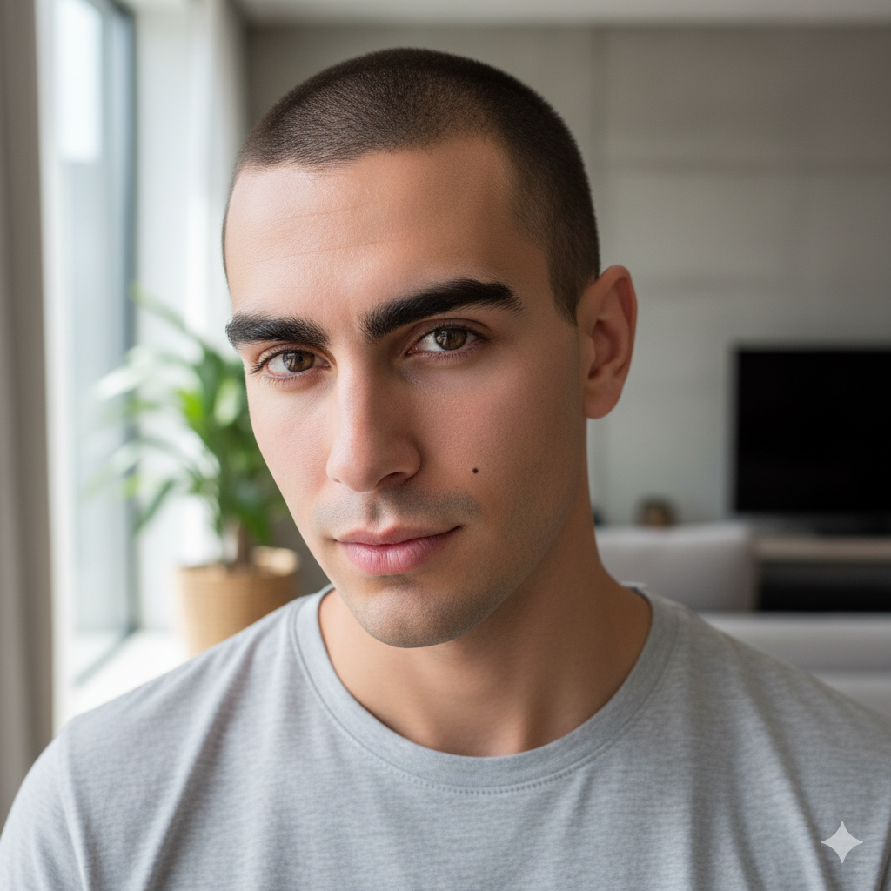 | 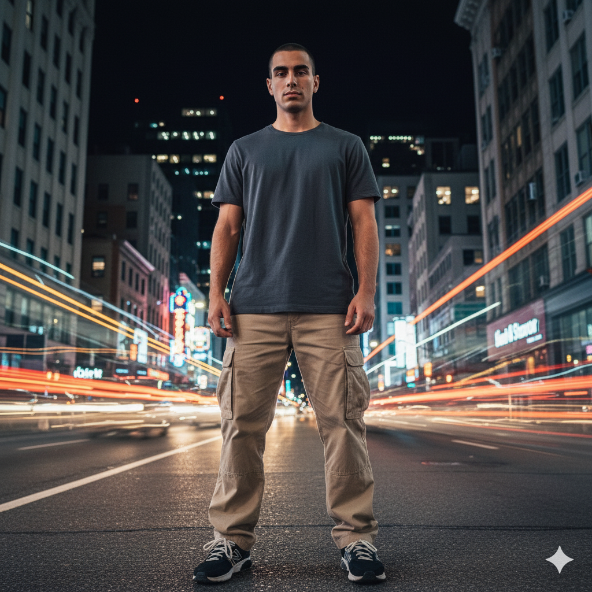 |

**输入:** 需上传一张参考图像

**提示词:**一张低角度广角摄影作品，黄昏或夜晚的城市街道上，图中男子自信站立，他直视镜头，神情平静却颇具吸引力，上身穿着简约的微宽松T恤，下身搭配宽松工装裤，脚踩运动鞋，光线极具戏剧张力，背景中色彩鲜艳的霓虹招牌与亮着灯的建筑呈模糊效果，既暗示着动态感，也传递出都市活力，这一拍摄视角让他在城市景观的映衬下显得身形高挑、气场十足，整体氛围现代而富有都市感，还带着一丝前卫锐利

例12：[Gopro超广角]("图片合集/万人迷.png) （[by 硅谷米哥]([硅谷米哥 - 小红书](https://www.xiaohongshu.com/user/profile/5f84695f0000000001008c8d?xsec_token=YBykWtZTdRMP1pyA3Pg-KU81AS-vU6lPEM-VL5M3bni6c=&xsec_source=app_share&xhsshare=CopyLink&shareRedId=ODs1Njo4OUE2NzUyOTgwNjY3OTc9Nkc9&apptime=1758443455&share_id=dc4d26610fcd4a30b0197d689c0cc308))）

| 输入                                                                                                   | 输出                                                                              |
|:----------------------------------------------------------------------------------------------------:|:-------------------------------------------------------------------------------:|
|  |  |

**输入:** 需上传一张参考图像

**提示词:**

```
采用高角度对称俯拍视角的广角GoPro 风格镜头，图中女子戴着黑色墨镜，身着线条利落的黑色西装，食指与拇指轻托面部，姿态自信，神情轻松地望向镜头，她周围，魅力四射的亚洲模特与热情的粉丝纷纷伸手，轻触她的手臂与肩头，更凸显出她极具吸引力的气场。画面下方，狗仔队的闪光灯不断闪烁，手持相机的记者们簇拥成团，营造出混乱却充满戏剧张力的氛围，GoPro
超广角镜头放大透视效果，让场景既具沉浸感与动感，又显得夸张震撼
```

例13：[陶瓷老人]("图片合集/陶瓷老人.png) （[by 硅谷米哥]([硅谷米哥 - 小红书](https://www.xiaohongshu.com/user/profile/5f84695f0000000001008c8d?xsec_token=YBykWtZTdRMP1pyA3Pg-KU81AS-vU6lPEM-VL5M3bni6c=&xsec_source=app_share&xhsshare=CopyLink&shareRedId=ODs1Njo4OUE2NzUyOTgwNjY3OTc9Nkc9&apptime=1758443455&share_id=dc4d26610fcd4a30b0197d689c0cc308))）

| 输入                                                                               | 输出                                                                               |
| -------------------------------------------------------------------------------- | -------------------------------------------------------------------------------- |
|  | 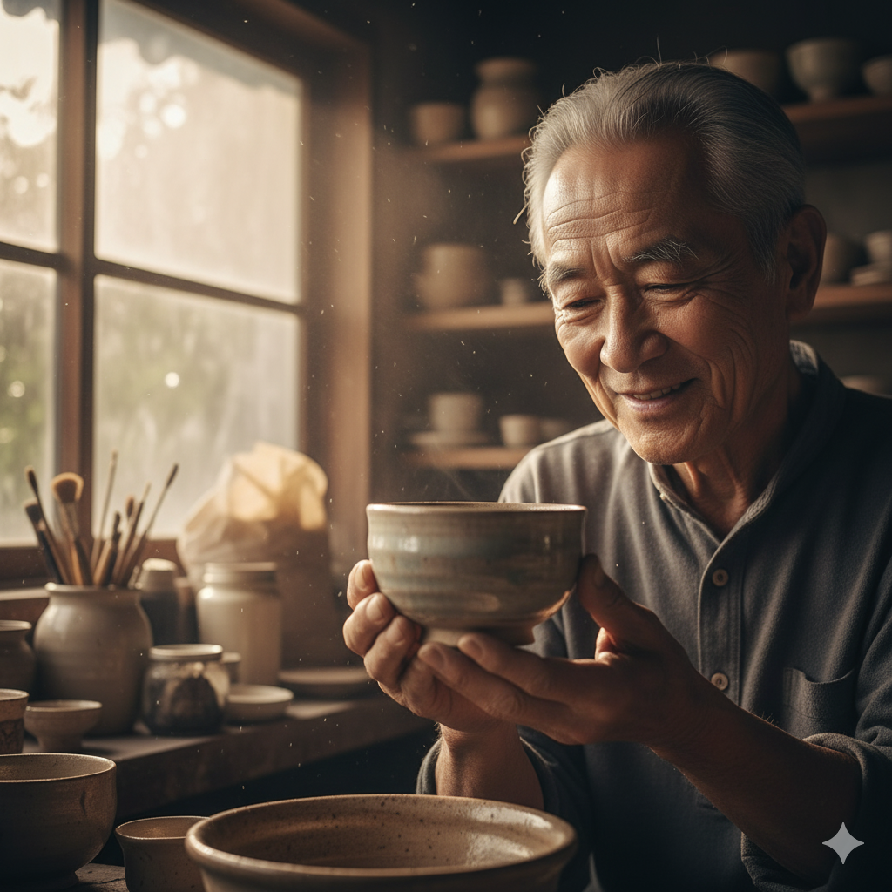 |

**输入:** 需上传一张参考图像

**提示词:**这是一幅逼真的特写照片，一位年长的日本陶艺家有着深深的皱纹，脸上带着温暖而会心的微笑。他正在仔细检查一个刚上过釉的茶碗。背景是他那充满阳光的乡村作坊。这一场景被柔和的、金色的小时光透过窗户照亮，突出了粘士的精细质地。用85mm人像镜头拍摄，背景柔和模糊（散景）。整体的氛围是平静而有主宰感的。垂直纵向方向

例14：[咖啡馆]("图片合集/咖啡.png) （[by 硅谷米哥]([硅谷米哥 - 小红书](https://www.xiaohongshu.com/user/profile/5f84695f0000000001008c8d?xsec_token=YBykWtZTdRMP1pyA3Pg-KU81AS-vU6lPEM-VL5M3bni6c=&xsec_source=app_share&xhsshare=CopyLink&shareRedId=ODs1Njo4OUE2NzUyOTgwNjY3OTc9Nkc9&apptime=1758443455&share_id=dc4d26610fcd4a30b0197d689c0cc308))）

| 输入                                                                                                   | 输出                                                                             |
| ---------------------------------------------------------------------------------------------------- | ------------------------------------------------------------------------------ |
|  |  |

**输入:** 需上传一张参考图像

**提示词:**

```
拍摄咖啡店特写，使用浅景深（背景虚化效果），搭配温暖的黄金时刻光线，角色手持带细微蒸汽的纸杯。保留面部特征与发型
```

例15：[手办]("图片合集/手办.png) （[by 硅谷米哥]([硅谷米哥 - 小红书](https://www.xiaohongshu.com/user/profile/5f84695f0000000001008c8d?xsec_token=YBykWtZTdRMP1pyA3Pg-KU81AS-vU6lPEM-VL5M3bni6c=&xsec_source=app_share&xhsshare=CopyLink&shareRedId=ODs1Njo4OUE2NzUyOTgwNjY3OTc9Nkc9&apptime=1758443455&share_id=dc4d26610fcd4a30b0197d689c0cc308))）

| 输入                                                                                | 输出                                                                             |
| --------------------------------------------------------------------------------- | ------------------------------------------------------------------------------ |
|  |  |

**输入:** 需上传一张参考图像

**提示词:**

```
将这张照片转换成一个角色手办。在其后方放置一个盒子，盒子上印有该角色的图像，并有一台电脑屏幕显示着Blender建模过程。在盒子前方添加一个圆形塑料底座，角色手办站立于底座上。场景尽量设置为室内环境。
```

例16：[卡通名片]("图片合集/卡通名片.png) （[by 硅谷米哥]([硅谷米哥 - 小红书](https://www.xiaohongshu.com/user/profile/5f84695f0000000001008c8d?xsec_token=YBykWtZTdRMP1pyA3Pg-KU81AS-vU6lPEM-VL5M3bni6c=&xsec_source=app_share&xhsshare=CopyLink&shareRedId=ODs1Njo4OUE2NzUyOTgwNjY3OTc9Nkc9&apptime=1758443455&share_id=dc4d26610fcd4a30b0197d689c0cc308))）

| 输入                                  | 输出                                    |
| ----------------------------------- | ------------------------------------- |
| 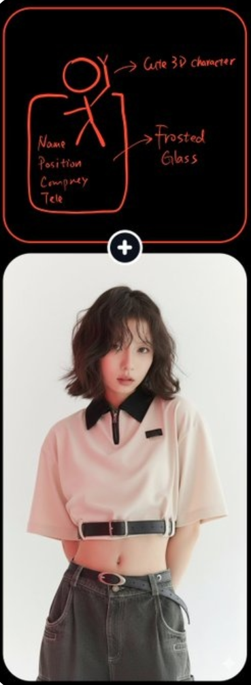 | 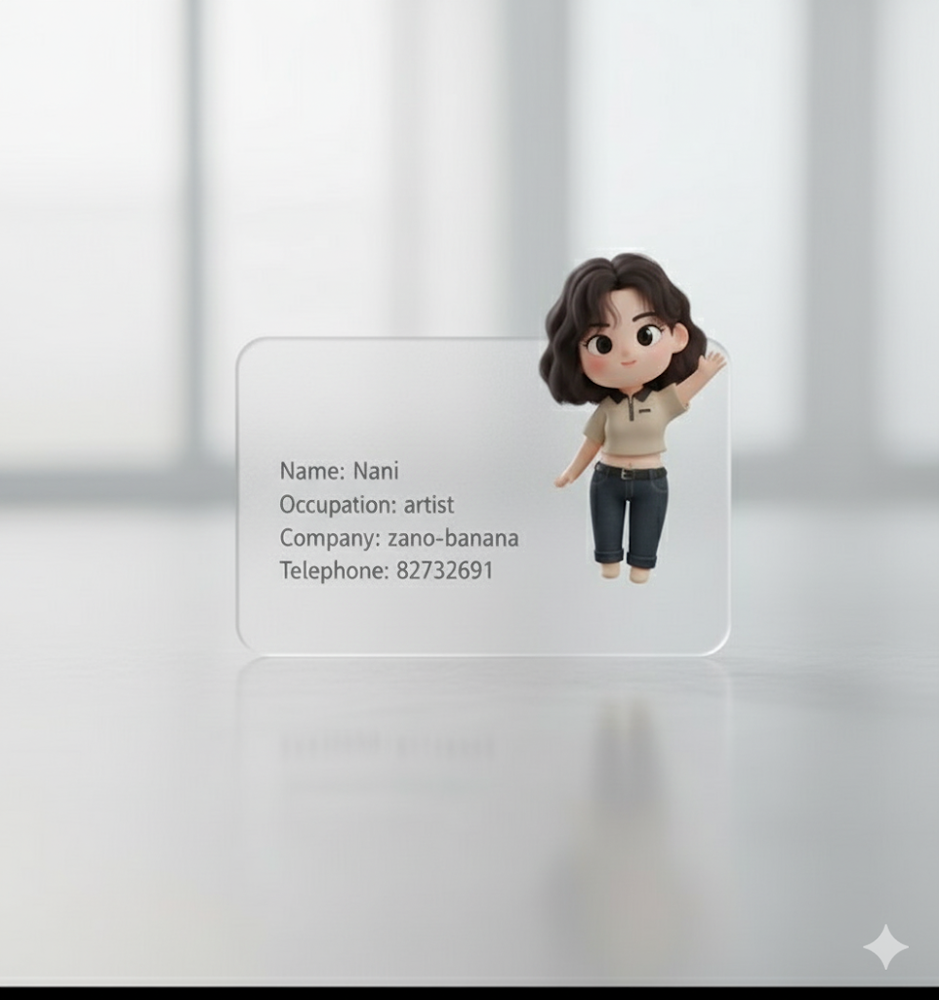 |

**输入:** 需上传一张参考图像

**提示词:**

```
按照我的图一名片设计稿的构图和质感，为我的图二人物生成卡片

卡片右上角为可爱卡通形象，突出于卡片

name: Nani
Occupation：artist
Company：zano-banana
Telephone：82732691
```

例17：[多组合]("图片合集/output.jpg) （[by 硅谷米哥]([硅谷米哥 - 小红书](https://www.xiaohongshu.com/user/profile/5f84695f0000000001008c8d?xsec_token=YBykWtZTdRMP1pyA3Pg-KU81AS-vU6lPEM-VL5M3bni6c=&xsec_source=app_share&xhsshare=CopyLink&shareRedId=ODs1Njo4OUE2NzUyOTgwNjY3OTc9Nkc9&apptime=1758443455&share_id=dc4d26610fcd4a30b0197d689c0cc308))）

| 输入                                     | 输出                                      |
| -------------------------------------- | --------------------------------------- |
|  |  |

**输入:** 需上传一张参考图像

**提示词:**一个模特摆姿势靠在粉色宝马车上。她穿着以下物品，场景背景是浅灰色。绿色外星人是一个钥匙扣，挂在粉色手提包上。模特肩上还有一只粉色鹦鹉。旁边坐着一只戴着粉色项圈和金色耳机的哈巴狗

例18：[人物正反侧面]("图片合集/正侧反面.png) （[by 硅谷米哥]([硅谷米哥 - 小红书](https://www.xiaohongshu.com/user/profile/5f84695f0000000001008c8d?xsec_token=YBykWtZTdRMP1pyA3Pg-KU81AS-vU6lPEM-VL5M3bni6c=&xsec_source=app_share&xhsshare=CopyLink&shareRedId=ODs1Njo4OUE2NzUyOTgwNjY3OTc9Nkc9&apptime=1758443455&share_id=dc4d26610fcd4a30b0197d689c0cc308))）

| 输入                                                                                                           | 输出                                                                               |
| ------------------------------------------------------------------------------------------------------------ | -------------------------------------------------------------------------------- |
|  |  |

**输入:** 需上传一张参考图像

**提示词:**生成一个人物的正面、侧面、背面视图，高分辨率，白背景

例19：[9种发型]("图片合集/9种发型.png) （[by 硅谷米哥]([硅谷米哥 - 小红书](https://www.xiaohongshu.com/user/profile/5f84695f0000000001008c8d?xsec_token=YBykWtZTdRMP1pyA3Pg-KU81AS-vU6lPEM-VL5M3bni6c=&xsec_source=app_share&xhsshare=CopyLink&shareRedId=ODs1Njo4OUE2NzUyOTgwNjY3OTc9Nkc9&apptime=1758443455&share_id=dc4d26610fcd4a30b0197d689c0cc308))）

| 输入                                    | 输出                                    |
| ------------------------------------- | ------------------------------------- |
|  | 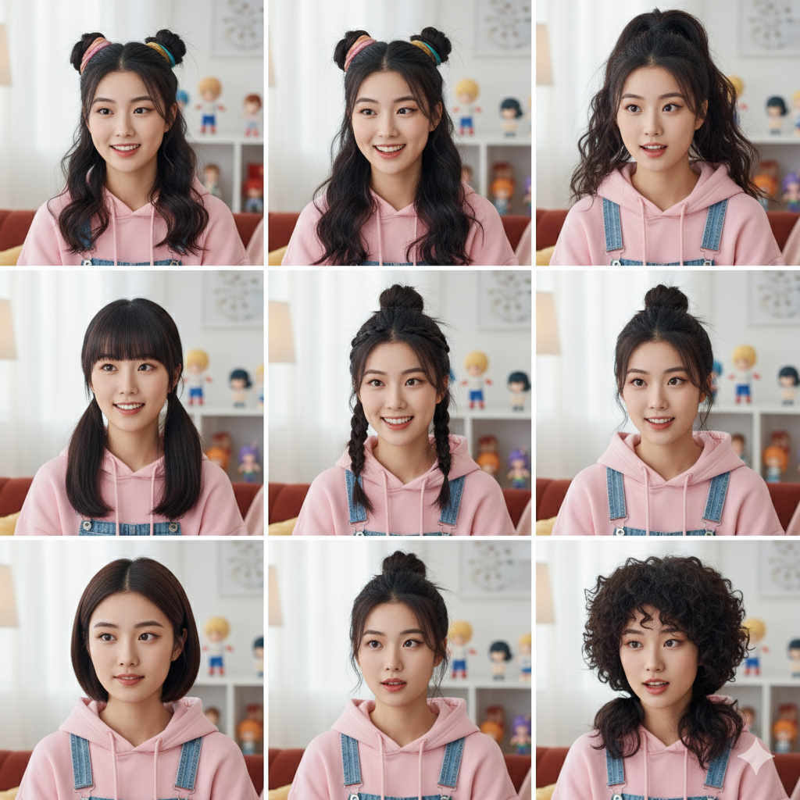 |

**输入:** 需上传一张参考图像

**提示词:**以九宫格的方式生成这个人不同发型的头像

例20：[3D图像]("图片合集/3D图像.png) （[by 硅谷米哥]([硅谷米哥 - 小红书](https://www.xiaohongshu.com/user/profile/5f84695f0000000001008c8d?xsec_token=YBykWtZTdRMP1pyA3Pg-KU81AS-vU6lPEM-VL5M3bni6c=&xsec_source=app_share&xhsshare=CopyLink&shareRedId=ODs1Njo4OUE2NzUyOTgwNjY3OTc9Nkc9&apptime=1758443455&share_id=dc4d26610fcd4a30b0197d689c0cc308))）

| 输入                                                                                 | 输出                                                                               |
| ---------------------------------------------------------------------------------- | -------------------------------------------------------------------------------- |
|  |  |

**输入:** 需上传一张参考图像

**提示词:**在轮廓内部绘制青色表面线框（网格状）网格，以展示从该视角所见图形的3D形状。

例21：[小孩儿旅游图]("图片合集/小孩儿.png) （[by 硅谷米哥]([硅谷米哥 - 小红书](https://www.xiaohongshu.com/user/profile/5f84695f0000000001008c8d?xsec_token=YBykWtZTdRMP1pyA3Pg-KU81AS-vU6lPEM-VL5M3bni6c=&xsec_source=app_share&xhsshare=CopyLink&shareRedId=ODs1Njo4OUE2NzUyOTgwNjY3OTc9Nkc9&apptime=1758443455&share_id=dc4d26610fcd4a30b0197d689c0cc308))）

| 输入                                    | 输出                                   |
| ------------------------------------- | ------------------------------------ |
| 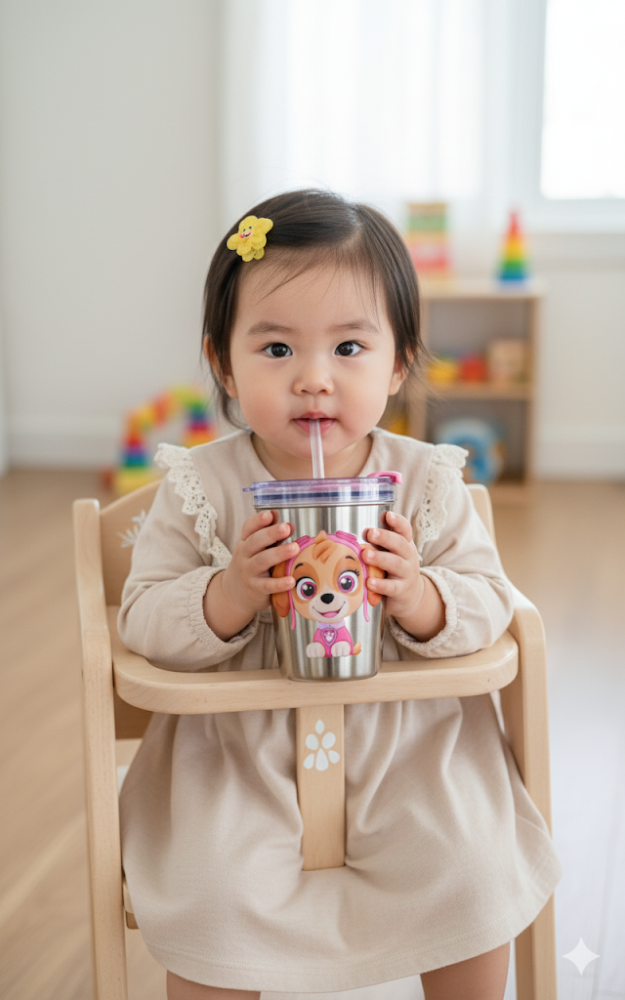 | 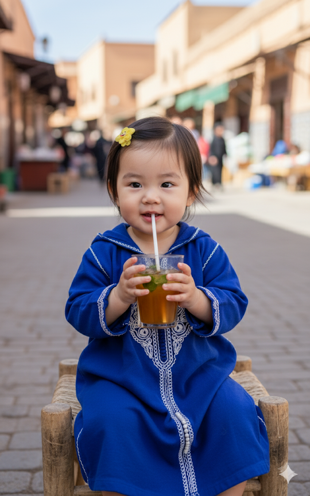 |

**输入:** 需上传一张参考图像

**提示词:**

```
将背景改为马拉喀什，衣服改为摩洛哥杰拉巴，坐在路边的凳子上，随意一点，改为喝一杯饮料
```

例22：[地铁图]("图片合集/地铁.png) （[by 硅谷米哥]([硅谷米哥 - 小红书](https://www.xiaohongshu.com/user/profile/5f84695f0000000001008c8d?xsec_token=YBykWtZTdRMP1pyA3Pg-KU81AS-vU6lPEM-VL5M3bni6c=&xsec_source=app_share&xhsshare=CopyLink&shareRedId=ODs1Njo4OUE2NzUyOTgwNjY3OTc9Nkc9&apptime=1758443455&share_id=dc4d26610fcd4a30b0197d689c0cc308))）

| 输入                                                                                                   | 输出                                                                             |
| ---------------------------------------------------------------------------------------------------- | ------------------------------------------------------------------------------ |
|  |  |

**输入:** 需上传一张参考图像

**提示词:**设置在地铁站台，冷蓝色氛围，后方打轮廓光；摄像机高度与胸部平齐，采用中景构图

例23：[照片修复]("图片合集/照片修复.png) （[by 硅谷米哥]([硅谷米哥 - 小红书](https://www.xiaohongshu.com/user/profile/5f84695f0000000001008c8d?xsec_token=YBykWtZTdRMP1pyA3Pg-KU81AS-vU6lPEM-VL5M3bni6c=&xsec_source=app_share&xhsshare=CopyLink&shareRedId=ODs1Njo4OUE2NzUyOTgwNjY3OTc9Nkc9&apptime=1758443455&share_id=dc4d26610fcd4a30b0197d689c0cc308))）

| 输入                                    | 输出                                    |
| ------------------------------------- | ------------------------------------- |
| 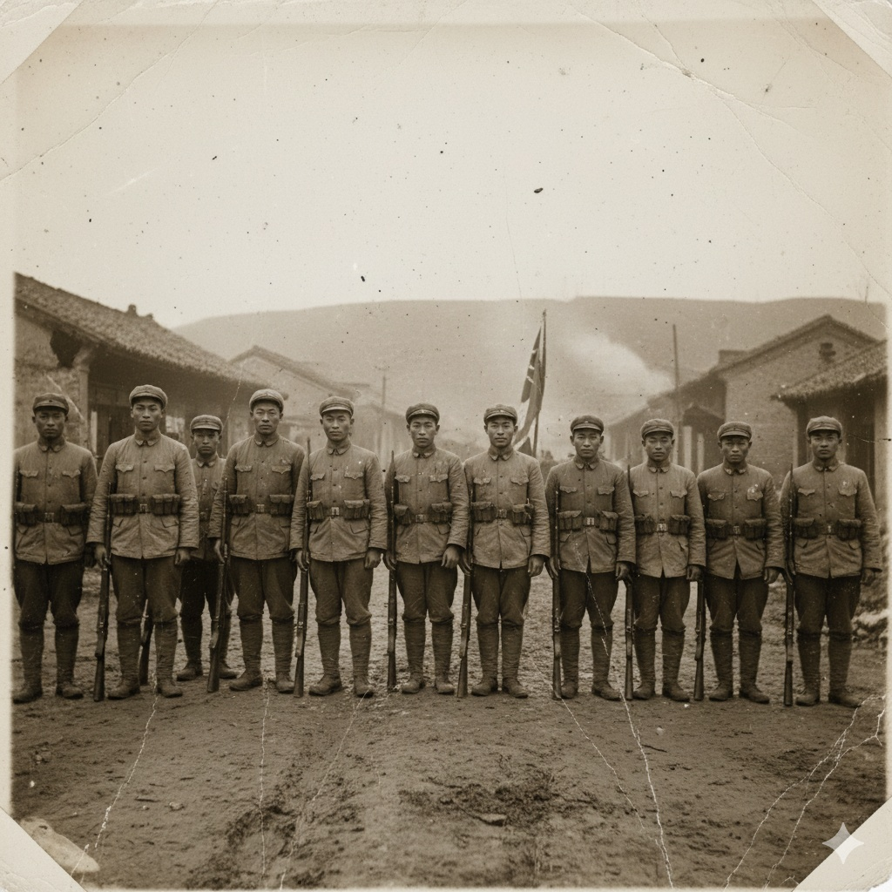 | 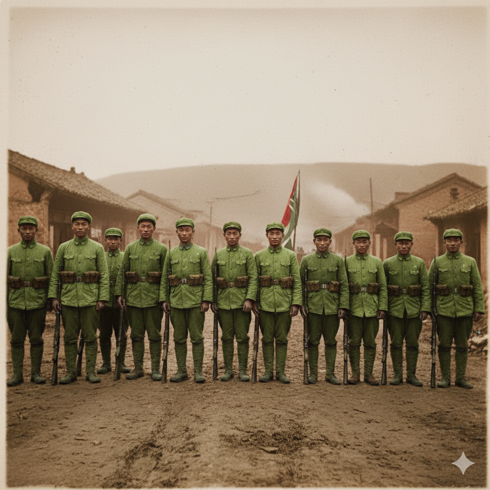 |

**输入:** 需上传一张参考图像

**提示词:**修复并为这张照片上色

例24：[雨夜街道]("图片合集/雨夜街道.png) （[by 硅谷米哥]([硅谷米哥 - 小红书](https://www.xiaohongshu.com/user/profile/5f84695f0000000001008c8d?xsec_token=YBykWtZTdRMP1pyA3Pg-KU81AS-vU6lPEM-VL5M3bni6c=&xsec_source=app_share&xhsshare=CopyLink&shareRedId=ODs1Njo4OUE2NzUyOTgwNjY3OTc9Nkc9&apptime=1758443455&share_id=dc4d26610fcd4a30b0197d689c0cc308))）

| 输入                                                                                                   | 输出                                                                               |
| ---------------------------------------------------------------------------------------------------- | -------------------------------------------------------------------------------- |
|  |  |

**输入:** 需上传一张参考图像

**提示词:**

```
设置在雨夜街道，地面呈现湿滑沥青反光与霓虹灯光；保留角色 eye color
```

例25：[夫妻故事]() （[by 硅谷米哥]([硅谷米哥 - 小红书](https://www.xiaohongshu.com/user/profile/5f84695f0000000001008c8d?xsec_token=YBykWtZTdRMP1pyA3Pg-KU81AS-vU6lPEM-VL5M3bni6c=&xsec_source=app_share&xhsshare=CopyLink&shareRedId=ODs1Njo4OUE2NzUyOTgwNjY3OTc9Nkc9&apptime=1758443455&share_id=dc4d26610fcd4a30b0197d689c0cc308))）

| 输入                                                                             | 输出                                                                             |
| ------------------------------------------------------------------------------ | ------------------------------------------------------------------------------ |
|  |  |

**输入:** 需上传一张参考图像

**提示词:**

```
用这两个角色创作一个令人上瘾的黑色电影侦探故事，不要在图像中包含任何文字或文本，纯粹通过图像本身讲述故事
```

例26：[人物换衣]("图片合集/换衣.jpg) （[by 硅谷米哥]([硅谷米哥 - 小红书](https://www.xiaohongshu.com/user/profile/5f84695f0000000001008c8d?xsec_token=YBykWtZTdRMP1pyA3Pg-KU81AS-vU6lPEM-VL5M3bni6c=&xsec_source=app_share&xhsshare=CopyLink&shareRedId=ODs1Njo4OUE2NzUyOTgwNjY3OTc9Nkc9&apptime=1758443455&share_id=dc4d26610fcd4a30b0197d689c0cc308))）

| 输入                                    | 输出                                  |
| ------------------------------------- | ----------------------------------- |
|  |  |

**输入:** 需上传一张参考图像

**提示词:**将输入图像中人物的服装替换为参考图像中显示的目标服装。保持人物的姿势、面部表情、背景和整体真实感不变。让新服装看起来自然、合身，并与光线和阴影保持一致。不要改变人物的身份或环境——只改变衣服

例27：[大理石]("图片合集/大理石.png) （[by 硅谷米哥]([硅谷米哥 - 小红书](https://www.xiaohongshu.com/user/profile/5f84695f0000000001008c8d?xsec_token=YBykWtZTdRMP1pyA3Pg-KU81AS-vU6lPEM-VL5M3bni6c=&xsec_source=app_share&xhsshare=CopyLink&shareRedId=ODs1Njo4OUE2NzUyOTgwNjY3OTc9Nkc9&apptime=1758443455&share_id=dc4d26610fcd4a30b0197d689c0cc308))）

| 输入                                                                                                   | 输出                                                                              |
| ---------------------------------------------------------------------------------------------------- | ------------------------------------------------------------------------------- |
|  |  |

**输入:** 需上传一张参考图像

**提示词:**

```
一张超详细的图像中主体雕塑的写实图像，由闪亮的大理石制成。雕塑应展示光滑反光的大理石表面，强调其光泽和艺术工艺。设计优雅，突出大理石的美丽和深度。图像中的光线应增强雕塑的轮廓和纹理，创造出视觉上令人惊叹和迷人的效果
```

例28：[人物姿势修改]("图片合集/人物姿势修改.jpg) （[by 硅谷米哥]([硅谷米哥 - 小红书](https://www.xiaohongshu.com/user/profile/5f84695f0000000001008c8d?xsec_token=YBykWtZTdRMP1pyA3Pg-KU81AS-vU6lPEM-VL5M3bni6c=&xsec_source=app_share&xhsshare=CopyLink&shareRedId=ODs1Njo4OUE2NzUyOTgwNjY3OTc9Nkc9&apptime=1758443455&share_id=dc4d26610fcd4a30b0197d689c0cc308))）

| 输入                                    | 输出                                      |
| ------------------------------------- | --------------------------------------- |
|  |  |

**输入:** 需上传一张参考图像

**提示词:**让图片中的人直视前方

例29：[东方明珠] （[by 硅谷米哥]([硅谷米哥 - 小红书](https://www.xiaohongshu.com/user/profile/5f84695f0000000001008c8d?xsec_token=YBykWtZTdRMP1pyA3Pg-KU81AS-vU6lPEM-VL5M3bni6c=&xsec_source=app_share&xhsshare=CopyLink&shareRedId=ODs1Njo4OUE2NzUyOTgwNjY3OTc9Nkc9&apptime=1758443455&share_id=dc4d26610fcd4a30b0197d689c0cc308))）

| 输入                                                                                                   | 输出                                                                               |
| ---------------------------------------------------------------------------------------------------- | -------------------------------------------------------------------------------- |
|  |  |

**输入:** 需上传一张参考图像

**提示词:**生成一张照片。用日常摄影风格，图片中人物双脚站在东方明珠电视塔最上面的塔尖上，人物咧嘴笑着，露出牙齿，在开心的自拍。塔的细节清晰可见，城市的景色在远处延伸。以一个较平的视角拍摄，构图上存在不准确的地方，画面边缘有些歪斜，整体色调是正常的日光色，给人一种真实平凡的自拍画面的感觉。

例30：[线稿图生成图像]("图片合集/线稿图生成图像.jpg) （[by 硅谷米哥]([硅谷米哥 - 小红书](https://www.xiaohongshu.com/user/profile/5f84695f0000000001008c8d?xsec_token=YBykWtZTdRMP1pyA3Pg-KU81AS-vU6lPEM-VL5M3bni6c=&xsec_source=app_share&xhsshare=CopyLink&shareRedId=ODs1Njo4OUE2NzUyOTgwNjY3OTc9Nkc9&apptime=1758443455&share_id=dc4d26610fcd4a30b0197d689c0cc308))）

| 输入                                   | 输出                                       |
| ------------------------------------ | ---------------------------------------- |
|  |  |

**输入:** 需上传一张参考图像

**提示词:**将图一人物换成图二姿势，专业摄影棚拍摄

例31：[长城]("图片合集/长城.png) （[by 硅谷米哥]([硅谷米哥 - 小红书](https://www.xiaohongshu.com/user/profile/5f84695f0000000001008c8d?xsec_token=YBykWtZTdRMP1pyA3Pg-KU81AS-vU6lPEM-VL5M3bni6c=&xsec_source=app_share&xhsshare=CopyLink&shareRedId=ODs1Njo4OUE2NzUyOTgwNjY3OTc9Nkc9&apptime=1758443455&share_id=dc4d26610fcd4a30b0197d689c0cc308))）

| 输入                                                                                                   | 输出                                                                             |
| ---------------------------------------------------------------------------------------------------- | ------------------------------------------------------------------------------ |
|  |  |

**输入:** 需上传一张参考图像

**提示词:**巨型的人物从城墙上低头俯视一座西安古城，睁大眼睛，惊奇的看着眼前繁华的街道和人来人往，微缩景观生动立体，人物的背景是蓝天白云，服饰不变。

例32：[为图像添加水印]("图片合集/添加水印.jpg) （[by 硅谷米哥]([硅谷米哥 - 小红书](https://www.xiaohongshu.com/user/profile/5f84695f0000000001008c8d?xsec_token=YBykWtZTdRMP1pyA3Pg-KU81AS-vU6lPEM-VL5M3bni6c=&xsec_source=app_share&xhsshare=CopyLink&shareRedId=ODs1Njo4OUE2NzUyOTgwNjY3OTc9Nkc9&apptime=1758443455&share_id=dc4d26610fcd4a30b0197d689c0cc308))）

| 输入                                  | 输出                                    |
| ----------------------------------- | ------------------------------------- |
|  |  |

**输入:** 需上传一张参考图像

**提示词:**在整个图片上反复覆盖“TRUMP”这个词。

例33：[写实照片]("图片合集/写实.png) （[by 硅谷米哥]([硅谷米哥 - 小红书](https://www.xiaohongshu.com/user/profile/5f84695f0000000001008c8d?xsec_token=YBykWtZTdRMP1pyA3Pg-KU81AS-vU6lPEM-VL5M3bni6c=&xsec_source=app_share&xhsshare=CopyLink&shareRedId=ODs1Njo4OUE2NzUyOTgwNjY3OTc9Nkc9&apptime=1758443455&share_id=dc4d26610fcd4a30b0197d689c0cc308))）

| 输入                                                                                                   | 输出                                                                             |
| ---------------------------------------------------------------------------------------------------- | ------------------------------------------------------------------------------ |
|  |  |

**输入:** 需上传一张参考图像

**提示词:**创建一张写实风格图片，图片中人物正参加艺术展览并和后方装置合影，装置为人物卡通样式，形象具有大眼睛的萌系艺术特征，装置参考输入图主体形象的服饰、配饰、发型、装饰，保持主体一致性，装置以自然站姿立在人物后方，体积大于人物，高于人物50%左右，营造比例反差，背景是简约观展现场，色系搭配与输入图一致，营造渐变、高级氛围.

例34：[广场雕塑]("图片合集/广场.png) （[by 硅谷米哥]([硅谷米哥 - 小红书](https://www.xiaohongshu.com/user/profile/5f84695f0000000001008c8d?xsec_token=YBykWtZTdRMP1pyA3Pg-KU81AS-vU6lPEM-VL5M3bni6c=&xsec_source=app_share&xhsshare=CopyLink&shareRedId=ODs1Njo4OUE2NzUyOTgwNjY3OTc9Nkc9&apptime=1758443455&share_id=dc4d26610fcd4a30b0197d689c0cc308))）

| 输入                                                                             | 输出                                                                             |
| ------------------------------------------------------------------------------ | ------------------------------------------------------------------------------ |
|  |  |

**输入:** 需上传一张参考图像

**提示词:**

```
一幅写实的摄影作品。这个人的巨型雕像被安放在东京市中心的广场上，人们仰望着它。
```

例35：[汉服造型]("图片合集/人物造型.png) （[by 硅谷米哥]([硅谷米哥 - 小红书](https://www.xiaohongshu.com/user/profile/5f84695f0000000001008c8d?xsec_token=YBykWtZTdRMP1pyA3Pg-KU81AS-vU6lPEM-VL5M3bni6c=&xsec_source=app_share&xhsshare=CopyLink&shareRedId=ODs1Njo4OUE2NzUyOTgwNjY3OTc9Nkc9&apptime=1758443455&share_id=dc4d26610fcd4a30b0197d689c0cc308))）

| 输入                                                                                                           | 输出                                                                               |
| ------------------------------------------------------------------------------------------------------------ | -------------------------------------------------------------------------------- |
|  |  |

**输入:** 需上传一张参考图像

**提示词:**

```
给图片中人物换上这样的造型：身穿唐代经典樱粉色齐胸襦裙（外层襦裙绣浅金缠枝莲纹，内层白色衬裙微透，肩带缀珍珠串），淡雅桃花妆（细眉、浅粉眼影、豆沙色唇釉），背景不要改变，姿势不要改变
```

例36：[宝丽来照片] （[by 硅谷米哥]([硅谷米哥 - 小红书](https://www.xiaohongshu.com/user/profile/5f84695f0000000001008c8d?xsec_token=YBykWtZTdRMP1pyA3Pg-KU81AS-vU6lPEM-VL5M3bni6c=&xsec_source=app_share&xhsshare=CopyLink&shareRedId=ODs1Njo4OUE2NzUyOTgwNjY3OTc9Nkc9&apptime=1758443455&share_id=dc4d26610fcd4a30b0197d689c0cc308))）

| 输入                                                                             | 输出                                                                              |
| ------------------------------------------------------------------------------ | ------------------------------------------------------------------------------- |
|  |  |

**输入:** 需上传一张参考图像

**提示词:**宝丽来照片，被手握着照片的一角，画面中是参考图片，柔和暖光在海边投下影子，胶片质感，写实且具清新艺术感

例37：[重置相机参数] （[by 硅谷米哥]([硅谷米哥 - 小红书](https://www.xiaohongshu.com/user/profile/5f84695f0000000001008c8d?xsec_token=YBykWtZTdRMP1pyA3Pg-KU81AS-vU6lPEM-VL5M3bni6c=&xsec_source=app_share&xhsshare=CopyLink&shareRedId=ODs1Njo4OUE2NzUyOTgwNjY3OTc9Nkc9&apptime=1758443455&share_id=dc4d26610fcd4a30b0197d689c0cc308))）

| 输入                                           | 输出                                      |
| -------------------------------------------- | --------------------------------------- |
| .jpg) |  |

**输入:** 需上传一张参考图像

**提示词:**RAW-ISO [100] - [F28-1/200 24mm] 设置 

例38：[赛车] （[by 硅谷米哥]([硅谷米哥 - 小红书](https://www.xiaohongshu.com/user/profile/5f84695f0000000001008c8d?xsec_token=YBykWtZTdRMP1pyA3Pg-KU81AS-vU6lPEM-VL5M3bni6c=&xsec_source=app_share&xhsshare=CopyLink&shareRedId=ODs1Njo4OUE2NzUyOTgwNjY3OTc9Nkc9&apptime=1758443455&share_id=dc4d26610fcd4a30b0197d689c0cc308))）

| 输入                                                                             | 输出                                                                             |
| ------------------------------------------------------------------------------ | ------------------------------------------------------------------------------ |
|  |  |

**输入:** 需上传一张参考图像

**提示词:**打造一张专业的跑车照片，以动漫风格的人物图案作为“痛车”（彩绘汽车）的设计，拍摄地点为著名的旅游景点或地标。汽车上醒目的大型动漫人物插图，构图简洁干净。人物图案应采用鲜艳的动漫艺术风格，色彩大胆，细节清晰。将车辆放置在自然光线充足的知名旅游景点或风景区，以展现车辆的运动外观和人物图案。运用专业的汽车摄影技巧，并结合适当的景深，突出“痛车”图案，同时融入风景背景，提升旅游吸引力，适合用于促销或爱好者营销材料。

例39：[等距图] （[by 硅谷米哥]([硅谷米哥 - 小红书](https://www.xiaohongshu.com/user/profile/5f84695f0000000001008c8d?xsec_token=YBykWtZTdRMP1pyA3Pg-KU81AS-vU6lPEM-VL5M3bni6c=&xsec_source=app_share&xhsshare=CopyLink&shareRedId=ODs1Njo4OUE2NzUyOTgwNjY3OTc9Nkc9&apptime=1758443455&share_id=dc4d26610fcd4a30b0197d689c0cc308))）

| 输入                                  | 输出                                   |
| ----------------------------------- | ------------------------------------ |
|  |  |

**输入:** 需上传一张参考图像

**提示词:**将图像转换为等距视图

例40：[成为Vtuber]("图片合集/VTUBER.png) （[by 硅谷米哥]([硅谷米哥 - 小红书](https://www.xiaohongshu.com/user/profile/5f84695f0000000001008c8d?xsec_token=YBykWtZTdRMP1pyA3Pg-KU81AS-vU6lPEM-VL5M3bni6c=&xsec_source=app_share&xhsshare=CopyLink&shareRedId=ODs1Njo4OUE2NzUyOTgwNjY3OTc9Nkc9&apptime=1758443455&share_id=dc4d26610fcd4a30b0197d689c0cc308))）

| 输入                                                                            | 输出                                                                                 |
| ----------------------------------------------------------------------------- | ---------------------------------------------------------------------------------- |
|  |  |

**输入:** 需上传一张参考图像

**提示词:**使用原图创建一个虚拟的Vtuber及其直播画面。
Vtuber的发型和服装将忠实还原原图。
Vtuber的画面为2.5D画质，无需完美还原原图风格，但需要适度的立体感。
Vtuber的表情和姿势可以与原图有所差异。请让Vtuber手持游戏手柄。
仅将Vtuber的上半身放置在屏幕右下方。将正在游玩的游戏直播画面放置在屏幕中央。将聊天画面放置在屏幕左侧。
游戏画面的屏幕比例设置为较大，Vtuber的上半身显示较小。
完全忽略原图的背景和姿势。
在屏幕的上下添加虚拟的直播平台和浏览器UI。
生成图像的纵横比与原始图像的纵横比无关。

例41：[全息照片]("图片合集/全息.png) （[by 硅谷米哥]([硅谷米哥 - 小红书](https://www.xiaohongshu.com/user/profile/5f84695f0000000001008c8d?xsec_token=YBykWtZTdRMP1pyA3Pg-KU81AS-vU6lPEM-VL5M3bni6c=&xsec_source=app_share&xhsshare=CopyLink&shareRedId=ODs1Njo4OUE2NzUyOTgwNjY3OTc9Nkc9&apptime=1758443455&share_id=dc4d26610fcd4a30b0197d689c0cc308))）

| 输入                                  | 输出                                  |
| ----------------------------------- | ----------------------------------- |
| 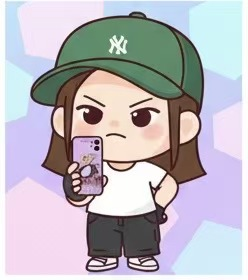 | 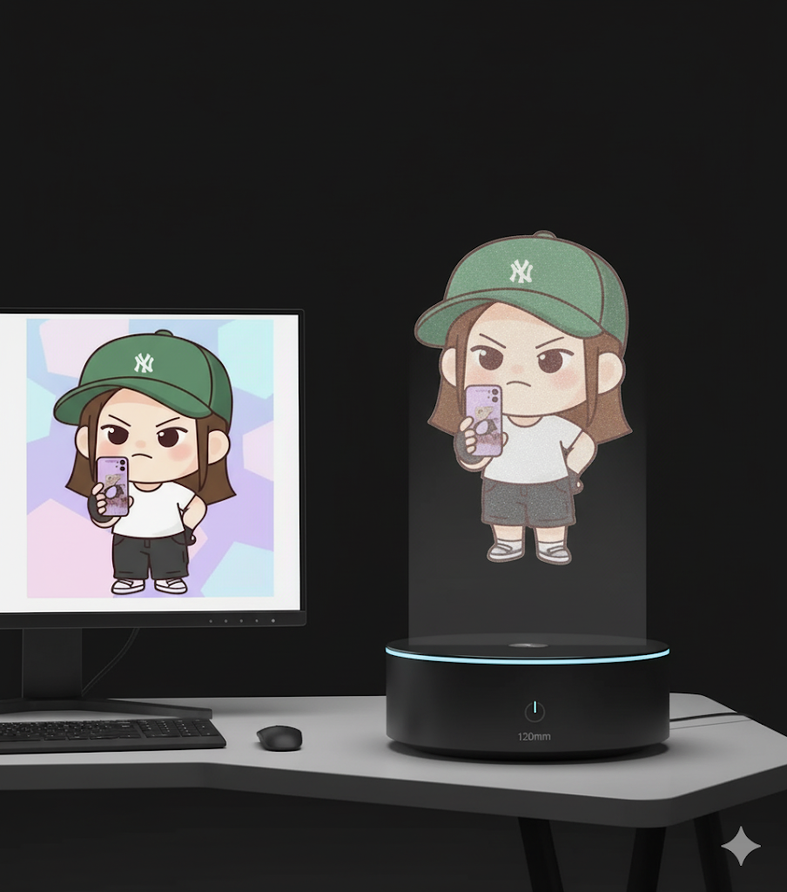 |

**输入:** 需上传一张参考图像

**提示词:**超逼真的产品照片。
主体：虚拟全息角色 [CHARACTER]，悬浮于现代桌面上直径 120 毫米的圆形全息投影仪上方。

投影源规则：

- 如果输入参考对象是 3D 物体，则在投影仪旁边放置一台桌面 3D 扫描仪。
  将参考对象放置在扫描板上。
  投影仪上方的全息图由扫描对象生成。
- 如果输入参考对象是 2D 图像，则在桌面上放置一台带显示器的现代 PC。
  在显示器屏幕上显示参考图像。
  投影仪上方的全息图由该屏幕内容生成。

全息图渲染规则：

- 角色始终显示为半透明的体积图像，背景隐约可见。
- 无光束、无粒子、无实体雕像表面。
- 均衡的解剖结构（头身比例为 1/7-1/8），比例正确。
- 姿势自然，轮廓清晰。
- 头发、衣服褶皱和配饰可见但半透明。
- 面部清晰富有表现力，在 1000 像素裁剪下清晰可读。
- 无版权角色、无品牌设计、无 IP 标识。

环境：现代办公桌，带投影仪底座 + 辅助设备（扫描仪或显示器）。
相机：85-100 毫米镜头，3/4 英雄角，眼平，f/11-f/16，ISO100，三脚架。
照明：桌面柔和照明；全息人物仅由体积光定义。
背景：无缝黑色工作室，反射微妙。

输出：4:5，2048×2560。

负片：无文字、无水印、无标识、无品牌、版权角色、系列 IP、商标设计、树脂、PVC、实体雕像、不透明表面、玩具光泽、光束、扫描线、点、失真、多余数字。
采样：确定性，Seed=12345，Temperature=0。

例42：[品牌工作室照片]() （[by 硅谷米哥]([硅谷米哥 - 小红书](https://www.xiaohongshu.com/user/profile/5f84695f0000000001008c8d?xsec_token=YBykWtZTdRMP1pyA3Pg-KU81AS-vU6lPEM-VL5M3bni6c=&xsec_source=app_share&xhsshare=CopyLink&shareRedId=ODs1Njo4OUE2NzUyOTgwNjY3OTc9Nkc9&apptime=1758443455&share_id=dc4d26610fcd4a30b0197d689c0cc308))）

| 输入                                                                               | 输出                                                                                  |
| -------------------------------------------------------------------------------- | ----------------------------------------------------------------------------------- |
|  |  |

**输入:** 需上传一张参考图像

**提示词:**

```
[爱因斯坦]居中坐在一张超大的蓬松休闲沙发上，沙发颜色为[SOFA_COLOR]，放松姿势，一只手托着下巴，全身入镜。纯白色无缝影棚，顶级时尚摄影灯光，超现实感，极简风格。后墙上有大型喷漆涂鸦，内容为"[TEXT]"，带有柔和的喷漆溢出感和轻微滴落痕迹。85mm镜头视觉效果，细节清晰，无杂乱元素，无水印。画面比例3:4
```

例43：[肖像] （[by 硅谷米哥]([硅谷米哥 - 小红书](https://www.xiaohongshu.com/user/profile/5f84695f0000000001008c8d?xsec_token=YBykWtZTdRMP1pyA3Pg-KU81AS-vU6lPEM-VL5M3bni6c=&xsec_source=app_share&xhsshare=CopyLink&shareRedId=ODs1Njo4OUE2NzUyOTgwNjY3OTc9Nkc9&apptime=1758443455&share_id=dc4d26610fcd4a30b0197d689c0cc308))）

| 输入                                                                                                   | 输出                                                                             |
| ---------------------------------------------------------------------------------------------------- | ------------------------------------------------------------------------------ |
|  |  |

**输入:** 需上传一张参考图像

**提示词:**给图里的人生成工作室拍摄肖像照片,黑色背景,黑色T恤,采用侧光和半身像的构图

例44：[肖像石膏位于中心]("图片合集/肖像石膏.png) （[by 硅谷米哥]([硅谷米哥 - 小红书](https://www.xiaohongshu.com/user/profile/5f84695f0000000001008c8d?xsec_token=YBykWtZTdRMP1pyA3Pg-KU81AS-vU6lPEM-VL5M3bni6c=&xsec_source=app_share&xhsshare=CopyLink&shareRedId=ODs1Njo4OUE2NzUyOTgwNjY3OTc9Nkc9&apptime=1758443455&share_id=dc4d26610fcd4a30b0197d689c0cc308))）

| 输入                                                                               | 输出                                                                               |
| -------------------------------------------------------------------------------- | -------------------------------------------------------------------------------- |
|  |  |

**输入:** 需上传一张参考图像

**提示词:**

```
[角色] 的超写实肖像位于画面中心，周围环绕着数十座与真人等大的 [角色] 石质胸像；采用温暖的米色博物馆灯光，呈现哑光雪花石膏质感，构图对称，景深较浅（85 毫米镜头），带有细微的胶片颗粒感，画面比例为 3:4 竖版，无文字及水印。
```

例45：[3D图像]("图片合集/3D.png) （[by 硅谷米哥]([硅谷米哥 - 小红书](https://www.xiaohongshu.com/user/profile/5f84695f0000000001008c8d?xsec_token=YBykWtZTdRMP1pyA3Pg-KU81AS-vU6lPEM-VL5M3bni6c=&xsec_source=app_share&xhsshare=CopyLink&shareRedId=ODs1Njo4OUE2NzUyOTgwNjY3OTc9Nkc9&apptime=1758443455&share_id=dc4d26610fcd4a30b0197d689c0cc308))）

| 输入                                                                               | 输出                                                                             |
| -------------------------------------------------------------------------------- | ------------------------------------------------------------------------------ |
|  |  |

**输入:** 需上传一张参考图像

**提示词:**

```
超写实3D卡通肖像，人物[NAME]拥有表情丰富的大号头部和短小身体，面部细节生动充满活力。身着[OUTFIT / SIGNATURE LOOK]，摆出[POSE / ACTION]姿势。影棚灯光，卡通比例，皮克斯风格3D渲染，布料与肌肤纹理极度精细。身体比例略小于头部。1080x1080正方形画幅
```

例46：[品牌广告]("图片合集/广告.png) （[by 硅谷米哥]([硅谷米哥 - 小红书](https://www.xiaohongshu.com/user/profile/5f84695f0000000001008c8d?xsec_token=YBykWtZTdRMP1pyA3Pg-KU81AS-vU6lPEM-VL5M3bni6c=&xsec_source=app_share&xhsshare=CopyLink&shareRedId=ODs1Njo4OUE2NzUyOTgwNjY3OTc9Nkc9&apptime=1758443455&share_id=dc4d26610fcd4a30b0197d689c0cc308))）

| 输入                                                                               | 输出                                                                             |
| -------------------------------------------------------------------------------- | ------------------------------------------------------------------------------ |
|  |  |

**输入:** 需上传一张参考图像

**提示词:**

```
一则奢侈的 [DIamond] 品牌广告，以一位时尚的 [女孩] 为主角，摆出建筑窗框姿势，以半身向上的中景拍摄，完全在窗框内，手和道具自然地打破了框架边缘，但看不到腿或下半身，以戏剧性和 2×2 对称的网格构图排列。

一个人拿着[平板]，带着[微笑表情和大耳钉配饰]
有富有表现力的面部姿势，将现代时尚与时尚的时装美学融为一体。

以优雅的 [米白色背景颜色和材质] 背景为背景，具有微妙的纹理，并采用明亮的高级时尚工作室灯光，强调轮廓、反射和奢华细节。

拍摄风格为高端 [品牌类型] 奢侈品宣传活动，氛围迷人、标志性、尊贵。2:3 ar。四个画面均清晰地全高显示，底部或顶部均无裁剪。
```

例47：[扭蛋]("图片合集/扭蛋.png) （[by 硅谷米哥]([硅谷米哥 - 小红书](https://www.xiaohongshu.com/user/profile/5f84695f0000000001008c8d?xsec_token=YBykWtZTdRMP1pyA3Pg-KU81AS-vU6lPEM-VL5M3bni6c=&xsec_source=app_share&xhsshare=CopyLink&shareRedId=ODs1Njo4OUE2NzUyOTgwNjY3OTc9Nkc9&apptime=1758443455&share_id=dc4d26610fcd4a30b0197d689c0cc308))）

| 输入                                     | 输出                                  |
| -------------------------------------- | ----------------------------------- |
|  | 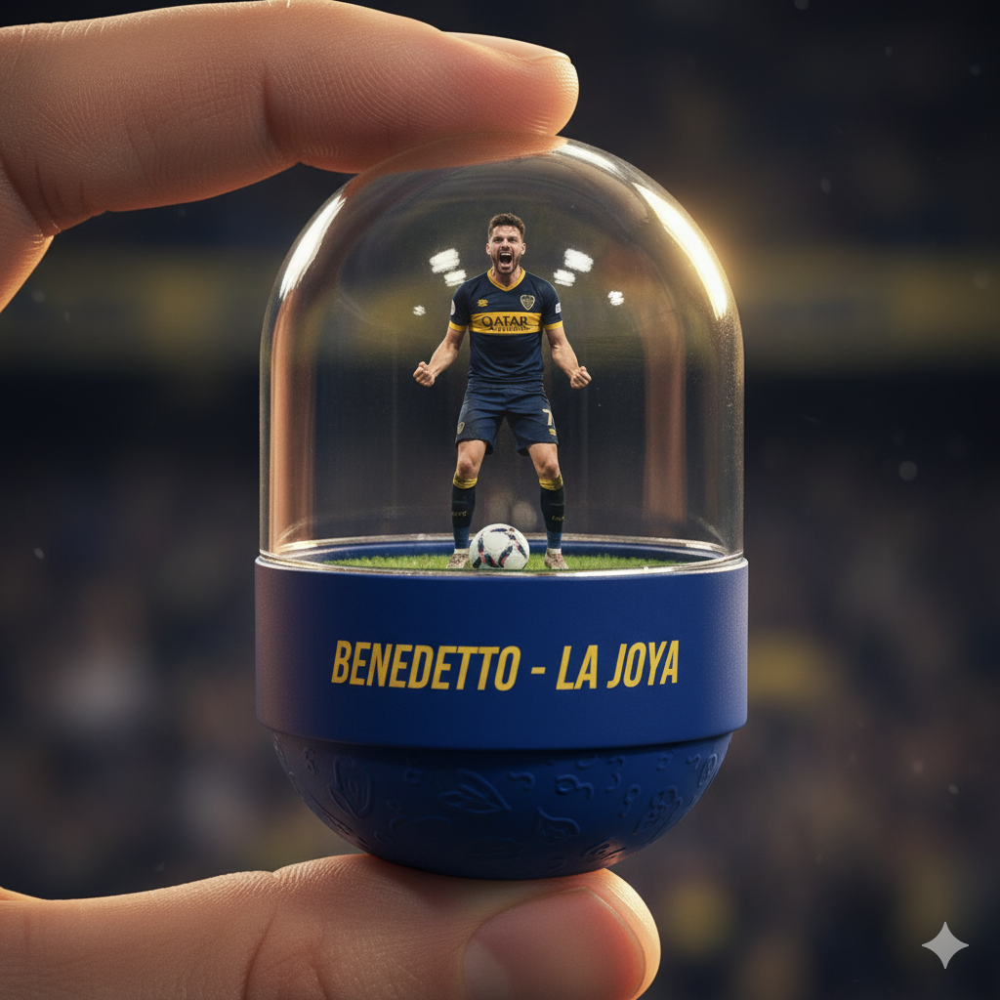 |


**输入:** 需上传一张参考图像

**提示词:**

```
一个详细的透明扭蛋场景模型，由手指捏握，扭蛋内呈现 人物名称 的 标志性姿势 形象。
扭蛋内部细节：足球运动员人偶身穿主队经典的[球队名称：必胜，蓝黑条纹]队服，队徽与赞助商标志清晰可见。人偶动态感十足，正做出[标志性动作，庆祝进球]的瞬间，面部表情专注激昂。球衣褶皱与球鞋鞋钉等细节刻画精细，脚下踩着一颗微缩的[足球颜色，如：黑白]相间足球
光线设计需富有戏剧感与电影质感，并契合人物主题（例如：金色聚光灯）。扭蛋顶部为透明材质，底部为彩色设计（选用契合主题的颜色，如宝蓝色），底部装饰有 [与该人物相关的图案元素]。
扭蛋底座以匹配风格的字体标注有 [人物名称或昵称]。整体设计需呈现迷你收藏品的质感，细节超写实，搭配柔和的虚化背景，采用 1080x1080 像素的正方形构图。
```

例48：[Q版木雕]("图片合集/Q版木雕.png) （[by 硅谷米哥]([硅谷米哥 - 小红书](https://www.xiaohongshu.com/user/profile/5f84695f0000000001008c8d?xsec_token=YBykWtZTdRMP1pyA3Pg-KU81AS-vU6lPEM-VL5M3bni6c=&xsec_source=app_share&xhsshare=CopyLink&shareRedId=ODs1Njo4OUE2NzUyOTgwNjY3OTc9Nkc9&apptime=1758443455&share_id=dc4d26610fcd4a30b0197d689c0cc308))）

| 输入                                    | 输出                                    |
| ------------------------------------- | ------------------------------------- |
| 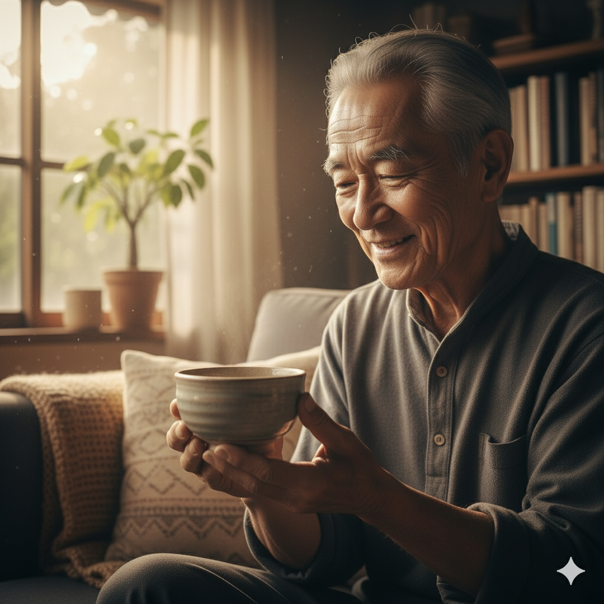 | 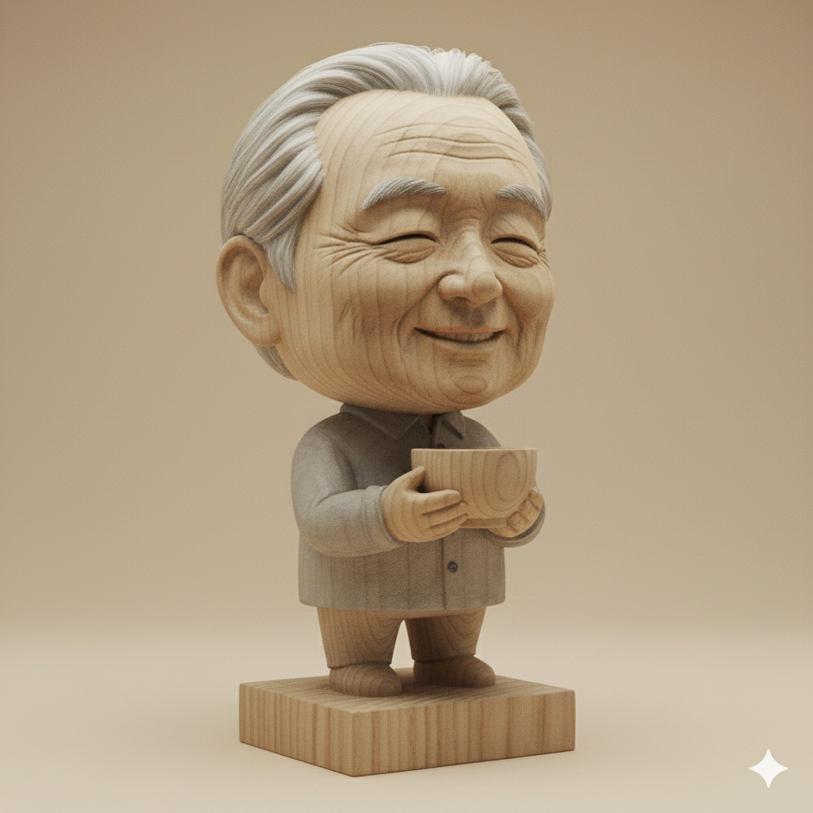 |

**输入:** 需上传一张参考图像

**提示词:**超写实[人物]木雕人偶，Q版比例（大头短身），站立于一块普通木块上。保留关键面部特征和标志性[服装/道具]。木纹和凿痕清晰可见，哑光饰面。工作室暖光，柔和阴影，米色背景浑然一体。全身居中，略微3/4视角，浅景深（85毫米画质）。细节丰富，照片级写实，暖棕褐色调。宽高比为[3:4]。

例49：[鸡胸肉扣篮] （[by 硅谷米哥]([硅谷米哥 - 小红书](https://www.xiaohongshu.com/user/profile/5f84695f0000000001008c8d?xsec_token=YBykWtZTdRMP1pyA3Pg-KU81AS-vU6lPEM-VL5M3bni6c=&xsec_source=app_share&xhsshare=CopyLink&shareRedId=ODs1Njo4OUE2NzUyOTgwNjY3OTc9Nkc9&apptime=1758443455&share_id=dc4d26610fcd4a30b0197d689c0cc308))）

| 输入                                  | 输出                                     |
| ----------------------------------- | -------------------------------------- |
| 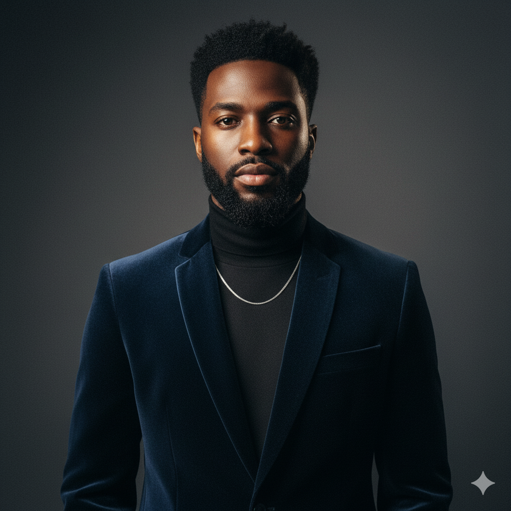 | 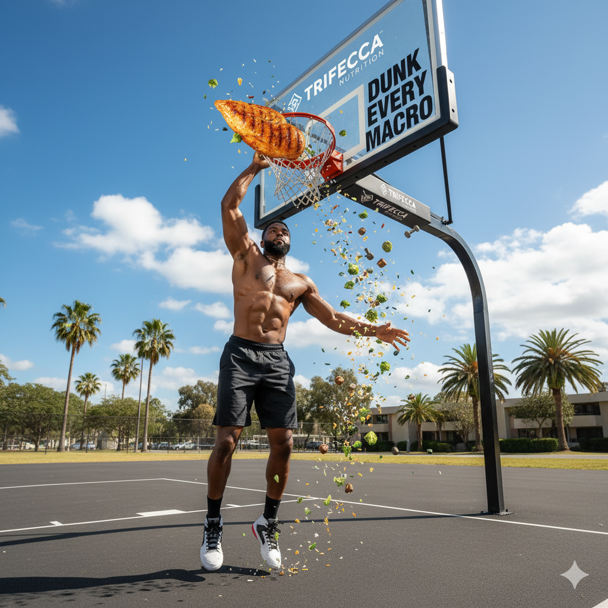 |

**输入:** 需上传一张参考图像

**提示词:**晴朗天空下，肌肉发达的男子将一块烤鸡胸肉扣进篮球框，篮框上写着“扣篮，每个宏都扣篮”（DUNK EVERY MACRO）。健身主题，带有 Trifecta 标志。

例50：[人物玩具] （[by 硅谷米哥]([硅谷米哥 - 小红书](https://www.xiaohongshu.com/user/profile/5f84695f0000000001008c8d?xsec_token=YBykWtZTdRMP1pyA3Pg-KU81AS-vU6lPEM-VL5M3bni6c=&xsec_source=app_share&xhsshare=CopyLink&shareRedId=ODs1Njo4OUE2NzUyOTgwNjY3OTc9Nkc9&apptime=1758443455&share_id=dc4d26610fcd4a30b0197d689c0cc308))）

| 输入                                     | 输出                                    |
| -------------------------------------- | ------------------------------------- |
|  | 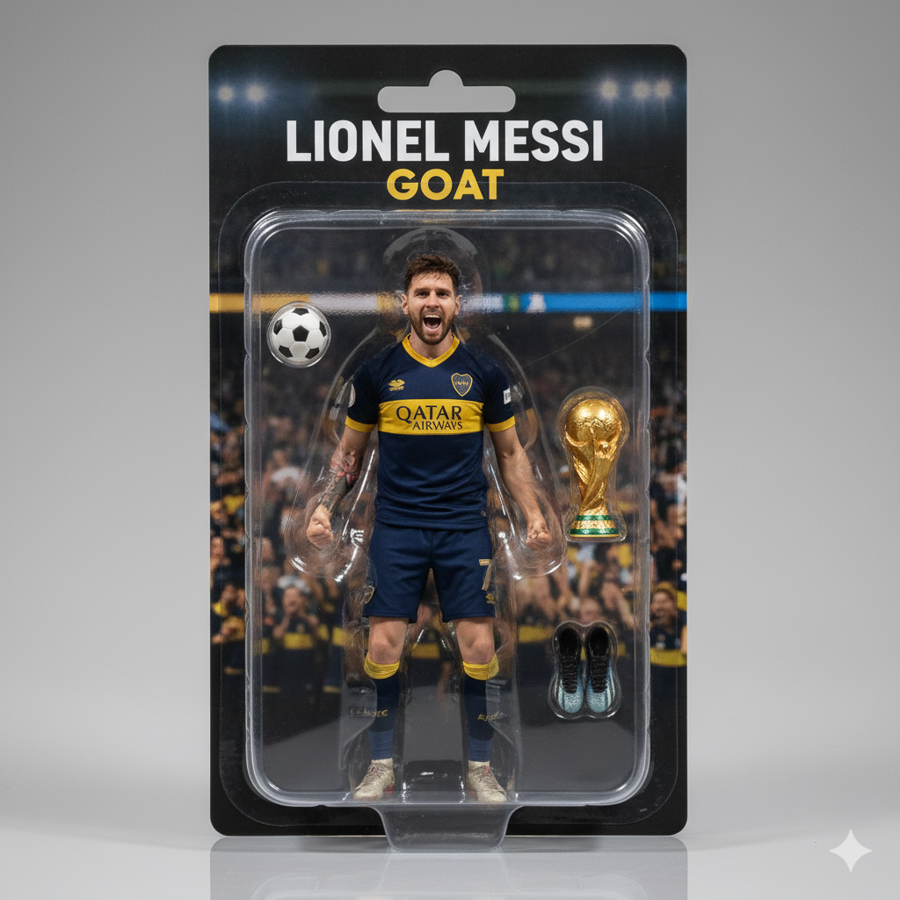 |

**输入:** 需上传一张参考图像

**提示词:**

```
制作照片中人物的玩具，做成一个可动人偶。人偶旁边要有玩具装备，比如足球、足球鞋和世界杯奖杯。另外，在包装盒顶部写上“LIONEL MESSI”，其下方写上“GOAT”。请以写实的风格呈现这一画面。
```

例51：[3D钥匙扣]("图片合集/3D钥匙扣.png) （[by 硅谷米哥]([硅谷米哥 - 小红书](https://www.xiaohongshu.com/user/profile/5f84695f0000000001008c8d?xsec_token=YBykWtZTdRMP1pyA3Pg-KU81AS-vU6lPEM-VL5M3bni6c=&xsec_source=app_share&xhsshare=CopyLink&shareRedId=ODs1Njo4OUE2NzUyOTgwNjY3OTc9Nkc9&apptime=1758443455&share_id=dc4d26610fcd4a30b0197d689c0cc308))）

| 输入                                   | 输出                                     |
| ------------------------------------ | -------------------------------------- |
|  | 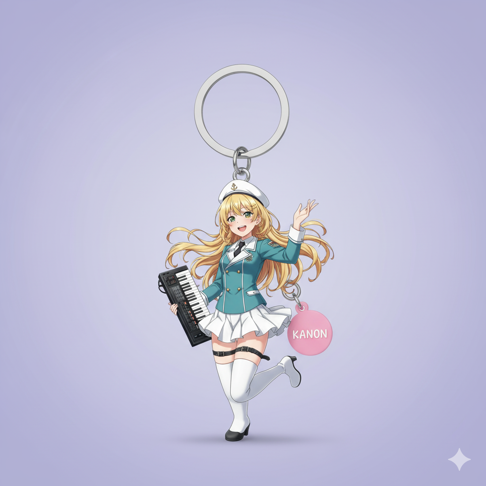 |

**输入:** 需上传一张参考图像

**提示词:**将上传照片中的人物制作成可爱的3D卡通钥匙扣版本。将面部和姿势转变为柔和、简化的玩具般造型，具有类似硅胶的光滑质感和柔和的粉彩色调。添加一个写有“[姓名]”的姓名牌，用俏皮的圆体字附着在钥匙扣上。无背景，阴影极少。适合钥匙扣格式的玩具产品设计。

例52：[马赛克风格]("图片合集/马赛克风格.png) （[by 硅谷米哥]([硅谷米哥 - 小红书](https://www.xiaohongshu.com/user/profile/5f84695f0000000001008c8d?xsec_token=YBykWtZTdRMP1pyA3Pg-KU81AS-vU6lPEM-VL5M3bni6c=&xsec_source=app_share&xhsshare=CopyLink&shareRedId=ODs1Njo4OUE2NzUyOTgwNjY3OTc9Nkc9&apptime=1758443455&share_id=dc4d26610fcd4a30b0197d689c0cc308))）

| 输入                                  | 输出                                     |
| ----------------------------------- | -------------------------------------- |
|  | 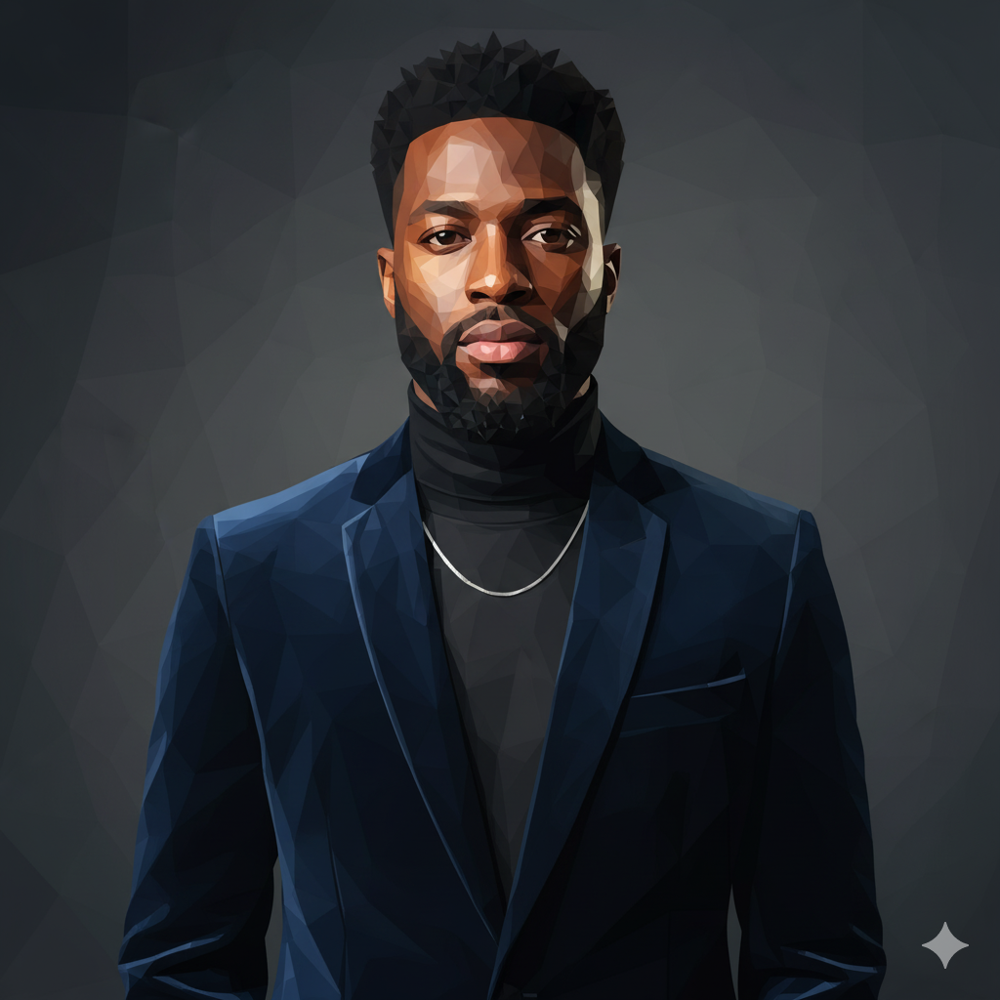 |

**输入:** 需上传一张参考图像

**提示词:**

```
将这张图片转换为精致的低多边形马赛克风格。保留原始结构和可识别的细节，尤其是面部特征和轮廓。使用小而密集的多边形，在保持清晰度和辨识度的同时，营造出水晶般的多面效果。保留原始色调，以获得和谐自然的美感。避免修改或添加新元素。
```

例53：[艺术风格]("图片合集/艺术风格.png) （[by 硅谷米哥]([硅谷米哥 - 小红书](https://www.xiaohongshu.com/user/profile/5f84695f0000000001008c8d?xsec_token=YBykWtZTdRMP1pyA3Pg-KU81AS-vU6lPEM-VL5M3bni6c=&xsec_source=app_share&xhsshare=CopyLink&shareRedId=ODs1Njo4OUE2NzUyOTgwNjY3OTc9Nkc9&apptime=1758443455&share_id=dc4d26610fcd4a30b0197d689c0cc308))）

| 输入                                      | 输出                                    |
| --------------------------------------- | ------------------------------------- |
|  | 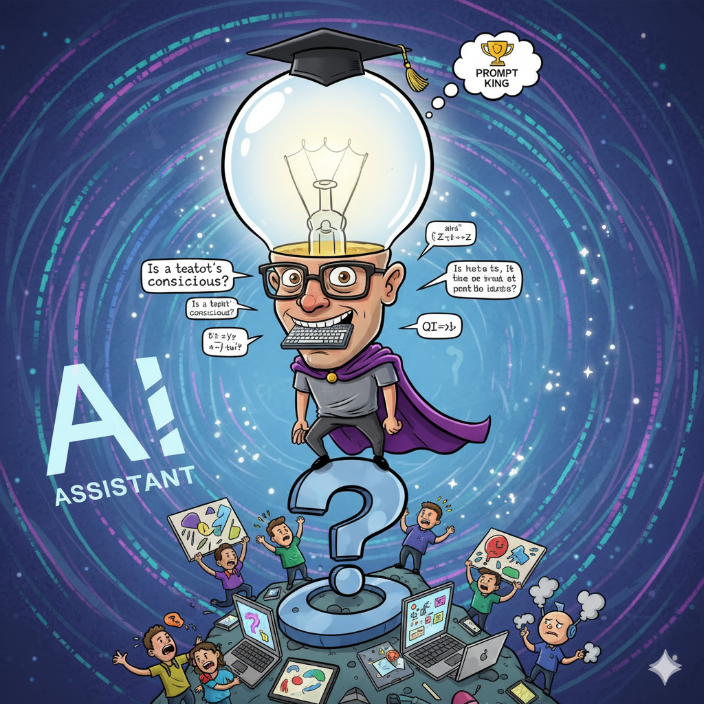 |

**输入:** 需上传一张参考图像

**提示词:**

```
根据您对我的个性和过去互动的理解，创建一个幽默、讽刺的图像，以俏皮的方式嘲笑我。图像必须具有喜剧特征，使用夸张的表情或超现实的视觉隐喻。艺术风格：具有高对比度和富有表现力的细节的卡通或漫画。目标是笑，而不是侮辱。确保讽刺是聪明和有意识的。例10：[手绘稿] （[by 硅谷米哥]([硅谷米哥 - 小红书](https://www.xiaohongshu.com/user/profile/5f84695f0000000001008c8d?xsec_token=YBykWtZTdRMP1pyA3Pg-KU81AS-vU6lPEM-VL5M3bni6c=&xsec_source=app_share&xhsshare=CopyLink&shareRedId=ODs1Njo4OUE2NzUyOTgwNjY3OTc9Nkc9&apptime=1758443455&share_id=dc4d26610fcd4a30b0197d689c0cc308))）
```

| 输入  | 输出  |
| --- | --- |
|     |     |

**输入:** 需上传一张参考图像

**提示词:**

```
将图片转为手绘图线稿
```

例10：[手绘稿] （[by 硅谷米哥]([硅谷米哥 - 小红书](https://www.xiaohongshu.com/user/profile/5f84695f0000000001008c8d?xsec_token=YBykWtZTdRMP1pyA3Pg-KU81AS-vU6lPEM-VL5M3bni6c=&xsec_source=app_share&xhsshare=CopyLink&shareRedId=ODs1Njo4OUE2NzUyOTgwNjY3OTc9Nkc9&apptime=1758443455&share_id=dc4d26610fcd4a30b0197d689c0cc308))）

| 输入  | 输出  |
| --- | --- |
|     |     |

**输入:** 需上传一张参考图像

**提示词:**

```
将图片转为手绘图线稿
```

例10：[手绘稿] （[by 硅谷米哥]([硅谷米哥 - 小红书](https://www.xiaohongshu.com/user/profile/5f84695f0000000001008c8d?xsec_token=YBykWtZTdRMP1pyA3Pg-KU81AS-vU6lPEM-VL5M3bni6c=&xsec_source=app_share&xhsshare=CopyLink&shareRedId=ODs1Njo4OUE2NzUyOTgwNjY3OTc9Nkc9&apptime=1758443455&share_id=dc4d26610fcd4a30b0197d689c0cc308))）

| 输入  | 输出  |
| --- | --- |
|     |     |

**输入:** 需上传一张参考图像

**提示词:**

```
将图片转为手绘图线稿
```

例10：[手绘稿] （[by 硅谷米哥]([硅谷米哥 - 小红书](https://www.xiaohongshu.com/user/profile/5f84695f0000000001008c8d?xsec_token=YBykWtZTdRMP1pyA3Pg-KU81AS-vU6lPEM-VL5M3bni6c=&xsec_source=app_share&xhsshare=CopyLink&shareRedId=ODs1Njo4OUE2NzUyOTgwNjY3OTc9Nkc9&apptime=1758443455&share_id=dc4d26610fcd4a30b0197d689c0cc308))）

| 输入  | 输出  |
| --- | --- |
|     |     |

**输入:** 需上传一张参考图像

**提示词:**

```
将图片转为手绘图线稿
```

例10：[手绘稿] （[by 硅谷米哥]([硅谷米哥 - 小红书](https://www.xiaohongshu.com/user/profile/5f84695f0000000001008c8d?xsec_token=YBykWtZTdRMP1pyA3Pg-KU81AS-vU6lPEM-VL5M3bni6c=&xsec_source=app_share&xhsshare=CopyLink&shareRedId=ODs1Njo4OUE2NzUyOTgwNjY3OTc9Nkc9&apptime=1758443455&share_id=dc4d26610fcd4a30b0197d689c0cc308))）

| 输入  | 输出  |
| --- | --- |
|     |     |

**输入:** 需上传一张参考图像

**提示词:**

```
将图片转为手绘图线稿
```

例10：[手绘稿] （[by 硅谷米哥]([硅谷米哥 - 小红书](https://www.xiaohongshu.com/user/profile/5f84695f0000000001008c8d?xsec_token=YBykWtZTdRMP1pyA3Pg-KU81AS-vU6lPEM-VL5M3bni6c=&xsec_source=app_share&xhsshare=CopyLink&shareRedId=ODs1Njo4OUE2NzUyOTgwNjY3OTc9Nkc9&apptime=1758443455&share_id=dc4d26610fcd4a30b0197d689c0cc308))）

| 输入  | 输出  |
| --- | --- |
|     |     |

**输入:** 需上传一张参考图像

**提示词:**

```
将图片转为手绘图线稿
```

例10：[手绘稿] （[by 硅谷米哥]([硅谷米哥 - 小红书](https://www.xiaohongshu.com/user/profile/5f84695f0000000001008c8d?xsec_token=YBykWtZTdRMP1pyA3Pg-KU81AS-vU6lPEM-VL5M3bni6c=&xsec_source=app_share&xhsshare=CopyLink&shareRedId=ODs1Njo4OUE2NzUyOTgwNjY3OTc9Nkc9&apptime=1758443455&share_id=dc4d26610fcd4a30b0197d689c0cc308))）

| 输入  | 输出  |
| --- | --- |
|     |     |

**输入:** 需上传一张参考图像

**提示词:**

```
将图片转为手绘图线稿
```

例10：[手绘稿] （[by 硅谷米哥]([硅谷米哥 - 小红书](https://www.xiaohongshu.com/user/profile/5f84695f0000000001008c8d?xsec_token=YBykWtZTdRMP1pyA3Pg-KU81AS-vU6lPEM-VL5M3bni6c=&xsec_source=app_share&xhsshare=CopyLink&shareRedId=ODs1Njo4OUE2NzUyOTgwNjY3OTc9Nkc9&apptime=1758443455&share_id=dc4d26610fcd4a30b0197d689c0cc308))）

| 输入  | 输出  |
| --- | --- |
|     |     |

**输入:** 需上传一张参考图像

**提示词:**

```
将图片转为手绘图线稿
```
